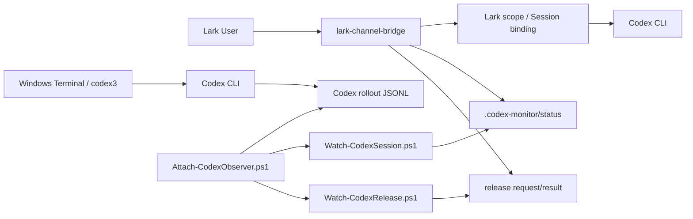

# lark-channel-bridge — Local Codex Session Handoff Extension

**English** | [简体中文](./README.zh-CN.md)

> This repository is a locally maintained extension of upstream `lark-channel-bridge`. Its main purpose is to support **remote monitoring, ownership transfer (handoff), handback, and multi-session management for Codex CLI sessions running on Windows through Lark/Feishu**.

Upstream documentation:

- [Preserved upstream README](./README.upstream.md)
- [Local documentation index](./local-docs/README.zh-CN.md)

---

## 1. Purpose

Upstream `lark-channel-bridge` already forwards Lark/Feishu messages to local coding agents such as Codex CLI and preserves independent sessions for different chats/topics. This local extension adds a workflow for sessions that are already running in Windows Terminal:

- Codex normally runs locally in Windows Terminal.
- When away from the computer, the user can inspect session state from Lark.
- Once a Windows Codex session finishes its current turn and becomes `Waiting`, ownership can be safely transferred to Lark.
- After remote work is finished in Lark, the session can be handed back to Windows.
- Multiple projects and Codex sessions can be managed at the same time.
- Different Lark groups can act as persistent, isolated Codex workspaces.

The key rule is **single writer / single logical owner**:

```text
One Codex Session
       │
       ├── Windows writer
       ├── Lark scope
       └── Detached / unbound

Only one logical writer should own the session at a time.
```

---

## 2. Typical Workflows

### 2.1 Windows → Lark

Start Codex on Windows:

```powershell
cd E:\AI_Tools\codex\AcuPilot
codex3
```

After the current task completes and the session is `Waiting`, run in the target Lark group:

```text
/local-status
/local-handoff <Thread-name-or-Session-ID-prefix>
```

After a successful handoff, the Windows writer is released and the current Lark scope is bound to the same Codex session. The next normal Lark message continues that session rather than creating a new one.

### 2.2 Lark → Windows

In the current Lark group:

```text
/handback
```

The bridge removes the session binding from the current Lark scope and returns a command similar to:

```powershell
cd 'E:\AI_Tools\codex\AcuPilot'
codex3 resume <Session-ID>
```

Run it on Windows to take control again.

### 2.3 Multiple Sessions / Projects

Treat a Lark group as a persistent Codex workspace:

```text
Spiderman's AI Assistant
│
├─ Direct Message
│   └─ Temporary management / ad-hoc sessions
│
├─ AcuPilot Group
│   └─ AcuPilot Codex Session
│
├─ Booking-WebForms Group
│   └─ Booking Web Forms Session
│
└─ Bridge-Dev Group
    └─ Bridge development Session
```

---

## 3. Local Additions

### 3.1 Windows Session Observer

Main scripts:

```text
scripts/windows/
├─ Attach-CodexObserver.ps1
├─ Watch-CodexSession.ps1
├─ Watch-CodexRelease.ps1
├─ Request-CodexRelease.ps1
├─ Release-CodexSession.ps1
├─ Stop-CodexObserver.ps1
└─ Install-CodexBridgeScripts.ps1
```

Runtime data:

```text
%USERPROFILE%\.codex-monitor\
├─ status-<SessionId>.json
├─ claims\
├─ launches\
├─ requests\
├─ results\
└─ logs\
```

### 3.2 Added Lark Commands

| Command | Purpose |
|---|---|
| `/local-status` | Show currently monitored Windows Codex sessions |
| `/local-status all` | Show active and historical monitor state |
| `/local-status history` | Show historical monitor state |
| `/local-release <Session>` | Release a Windows writer without binding Lark |
| `/local-handoff <Session>` | Windows → current Lark scope |
| `/handback` | Current Lark scope → Detached; prepare for Windows resume |
| `/sessions` | Show known Codex sessions, ownership, and working directory |
| `/sessions all` | Show more historical sessions |
| `/use <Session>` | Bind the current Lark scope to a Detached session |

`/use` is most useful for temporary switching in a direct-message control chat. For long-lived development, one Lark group per primary session plus `/local-handoff` and `/handback` is usually clearer.

### 3.3 Handoff State

`/local-status` exposes a lightweight pre-validation state:

```text
🟢 Ready
🔵 Busy
🟡 Needs validation
⚪ Detached
```

The TypeScript status is only a UI-level pre-check. Final safe release is performed by the local PowerShell release chain:

```text
Request-CodexRelease.ps1
        ↓
Watch-CodexRelease.ps1
        ↓
Release-CodexSession.ps1
```

Process identity, PID/parent relationships, and creation-time validation belong to that authoritative release layer.

---

## 4. Runtime Overview



See [local-docs/02-lark-bridge-codex-architecture.md](./local-docs/02-lark-bridge-codex-architecture.md) for details.

---

## 5. Prerequisites

- Node.js compatible with the upstream project (currently Node.js >= 20.12.0)
- Codex CLI or Claude Code installed
- A Lark/Feishu PersonalAgent
- pnpm
- Windows PowerShell 5.1 or PowerShell 7 for the Windows extension

For third-party Codex API providers, see:

[local-docs/01-codex-third-party-api-key.md](./local-docs/01-codex-third-party-api-key.md)

---

## 6. Build from Source

```powershell
cd "$HOME\Source\lark-channel-bridge-local"
pnpm install
pnpm typecheck
pnpm test
pnpm build
```

---

## 7. Install the Local Extension

Deploy Windows helper scripts:

```powershell
.\scripts\windows\Install-CodexBridgeScripts.ps1
```

Build and install the current repository globally:

```powershell
pnpm typecheck
pnpm build
npm install -g .
```

Restart the Codex profile:

```powershell
lark-channel-bridge stop --profile codex
lark-channel-bridge start --profile codex
lark-channel-bridge status --profile codex
```

Do not replace the local extension with a registry install such as:

```powershell
npm install -g lark-channel-bridge@latest
```

unless you intentionally want to remove the local additions.

---

## 8. Isolated `codex3` Environment

A separate `CODEX_HOME` is recommended for third-party providers:

```text
%USERPROFILE%\.codex-cli-thirdparty
```

Example wrapper:

```powershell
function codex3 {
    $oldCodexHome = $env:CODEX_HOME

    try {
        $env:CODEX_HOME = "$HOME\.codex-cli-thirdparty"
        & codex @args
    }
    finally {
        if ($null -eq $oldCodexHome) {
            Remove-Item Env:CODEX_HOME -ErrorAction SilentlyContinue
        }
        else {
            $env:CODEX_HOME = $oldCodexHome
        }
    }
}
```

The locally deployed wrapper may additionally start the Attach detector so that new Windows Codex sessions automatically enter `.codex-monitor`.

---

## 9. Daily Usage

Windows session status:

```text
/local-status
```

Windows → Lark:

```text
/local-handoff Online-Web-Forms
```

Lark → Windows:

```text
/handback
```

Session inventory:

```text
/sessions
/sessions all
```

Temporary switch to a Detached session:

```text
/use Calculate 1+2
```

Release Windows without automatic Lark takeover:

```text
/local-release <Session>
```

---

## 10. Attach / Observer Troubleshooting

Latest Attach log:

```powershell
$log =
    Get-ChildItem "$HOME\.codex-monitor\logs\attach-*.log" |
    Sort-Object LastWriteTime -Descending |
    Select-Object -First 1

Get-Content $log.FullName -Tail 50
```

A complete attach normally contains:

```text
Claimed Session ...
Observer PID=...
Release Agent PID=...
Launch mapping written: ...
Attach completed.
```

If it repeatedly reports:

```text
Codex PID=... is alive; still waiting for matching rollout Session...
```

the Codex process was discovered but a persistent session/rollout has not yet been matched.

---

## 11. Reapplying Local Changes after an Upstream Upgrade

Recommended remotes:

```text
origin   → your personal GitHub fork/repository
upstream → https://github.com/zarazhangrui/lark-coding-agent-bridge.git
```

Before upgrading, commit all local work:

```powershell
git status
git log --oneline -5
```

Fetch upstream:

```powershell
git fetch upstream
```

Perform the upgrade in a dedicated branch:

```powershell
git switch -c local/upgrade-<version>
git merge upstream/main
```

or, if your workflow prefers it:

```powershell
git rebase upstream/main
```

Files most likely to conflict with the local extension include:

```text
scripts/windows/*
src/commands/local-status.ts
src/commands/local-handoff.ts
src/commands/local-session-manager.ts
src/commands/local-session-state.ts
src/commands/local-release.ts
src/commands/index.ts
src/card/templates.ts
src/session/store.ts
```

After resolving conflicts:

```powershell
pnpm install
pnpm typecheck
pnpm test
pnpm build

npm install -g .
.\scripts\windows\Install-CodexBridgeScripts.ps1

lark-channel-bridge stop --profile codex
lark-channel-bridge start --profile codex
```

Minimum regression test:

```text
/local-status
/sessions
/local-handoff <test-session>
/handback
```

Then on Windows:

```powershell
codex3 resume <same-session-id>
```

Verify the complete cycle:

```text
Windows
   ↓ /local-handoff
Lark
   ↓ /handback
Windows resume
```

---

## 12. Security

Never commit:

```text
API keys
Lark App Secrets
.codex-monitor runtime files
encrypted profile secret files
personal credentials
```

Before committing:

```powershell
git status --short --untracked-files=all
git diff --cached
```

---

## 13. Local Documentation

- [Codex with a Third-Party API Key](./local-docs/01-codex-third-party-api-key.md)
- [Lark / Bridge / Codex Architecture](./local-docs/02-lark-bridge-codex-architecture.md)
- [Codex Session / Thread Management](./local-docs/03-codex-session-management.md)

---

## 14. Upstream

This repository is based on:

`zarazhangrui/lark-coding-agent-bridge`

The preserved upstream README is available at:

[README.upstream.md](./README.upstream.md)

