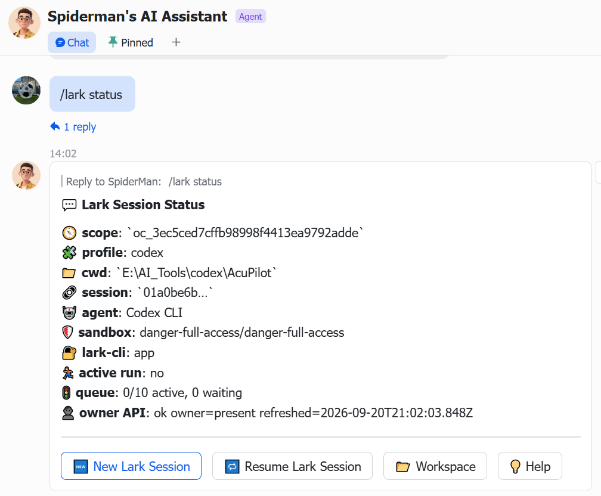
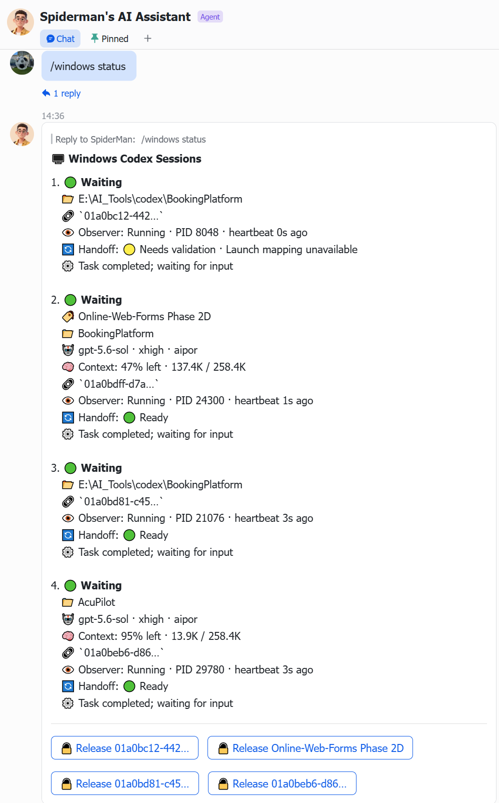
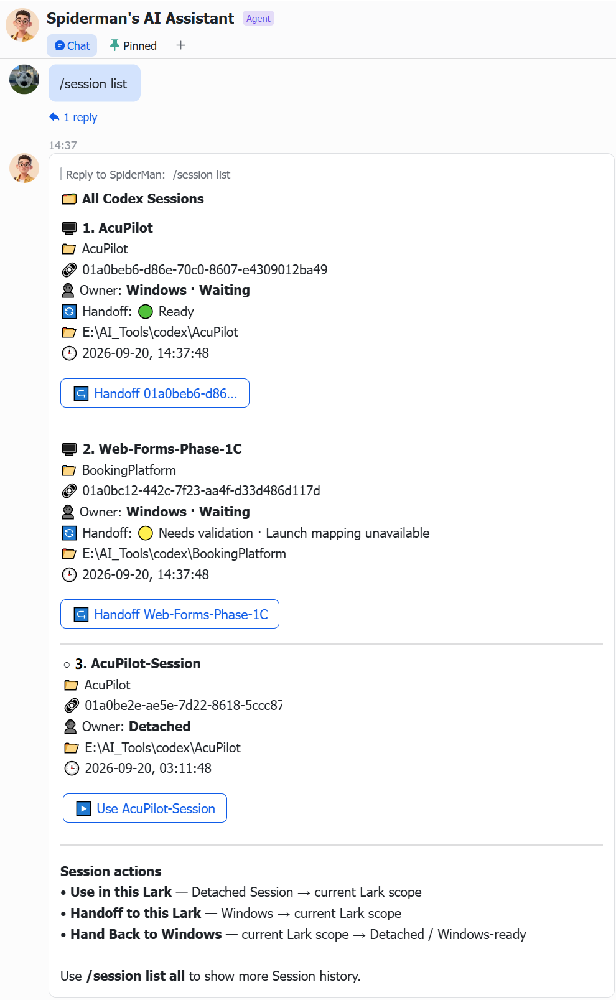

# lark-channel-bridge — Windows Session Remote Management Extension for Codex and Claude Code

**English** | [简体中文](./README.zh-CN.md)

> A Windows-focused downstream extension of **`lark-channel-bridge`** for discovering and monitoring local **Codex CLI** and **Claude Code** sessions, safely transferring session ownership between Windows and Lark, and remotely managing multiple sessions from Lark Mobile App or Lark Web.

## Upstream project — `lark-channel-bridge`

This repository is built on top of the upstream **`lark-channel-bridge`** project. The upstream project name is `lark-channel-bridge`; its GitHub repository is [`zarazhangrui/lark-coding-agent-bridge`](https://github.com/zarazhangrui/lark-coding-agent-bridge).

The upstream project provides the foundation used by this fork: a local bridge between **Feishu/Lark** and **Claude Code or Codex CLI**, with per-chat/topic session continuity, workspace switching, file/image forwarding, streaming/interactive cards, queueing, access controls, profiles, and background runtime management.

Please treat the upstream documentation as the authoritative reference for the original bridge behavior, installation, supported agents, and general configuration:

- **Upstream repository:** [`zarazhangrui/lark-coding-agent-bridge`](https://github.com/zarazhangrui/lark-coding-agent-bridge)
- **Original English README:** [Upstream `README.md`](https://github.com/zarazhangrui/lark-coding-agent-bridge/blob/main/README.md)
- **Original Chinese README:** [Upstream `README.zh.md`](https://github.com/zarazhangrui/lark-coding-agent-bridge/blob/main/README.zh.md)

This fork intentionally keeps the upstream project prominent in the documentation. The features below are **extensions built on top of `lark-channel-bridge`**, not a replacement for the original project.

## What this fork adds

The upstream bridge already lets a Lark Chat / Group / Topic interact with a local coding agent. This fork adds a Windows-focused **Session control plane** for Codex and Claude Code sessions that may have been started independently in Windows Terminal rather than created only through the current Lark scope. Each bot manages the agent its profile runs, with the same `/session` commands for both — see [Claude Code sessions](#claude-code-sessions).

| Area | Upstream `lark-channel-bridge` | This fork adds |
|---|---|---|
| Lark/Feishu ↔ Claude Code / Codex bridge | Core upstream feature | Reused as the foundation |
| Per-chat/topic session continuity | Core upstream feature | Preserved |
| Workspace switching and saved workspaces | Core upstream feature | Preserved |
| Streaming and interactive cards | Core upstream feature | Extended with session-control actions |
| Windows Codex / Claude Code sessions started independently of Lark | Not the focus of the original Lark scope model | Automatic local discovery and monitoring |
| Windows runtime view (Codex) | — | `/windows status` |
| Safe Windows writer release (Codex) | — | `/windows release` with Release Agent |
| Cross-runtime session inventory | — | `/session list` |
| Detached Session → current Lark scope | — | `/session use` |
| Windows → Lark ownership transfer | — | `/session handoff` |
| Lark → Windows-ready handback | — | `/session handback` |
| Session ownership model | Lark scope binding | Windows / Lark / Detached with a single-writer rule |
| Mobile/Web remote session control | General Lark interaction | Session switching and ownership actions optimized for **Lark Mobile App** and **Lark Web** |
| Action identity | Command-specific | Readable Thread Name in UI; exact full Session ID for execution |
| Claude Code sessions | Run as the agent of a `claude` profile | The same `/session` control plane on a Claude bot — see [Claude Code sessions](#claude-code-sessions) |

### Why these extensions exist

A common workflow is to start several Codex CLI or Claude Code sessions directly on a Windows workstation and later leave the computer. The additional monitoring, release, and ownership layers let Lark become a remote control surface for those existing sessions. For Codex the path looks like this (Claude Code needs no Observer — it keeps its own process registry; see [Claude Code sessions](#claude-code-sessions)):

```text
Windows Terminal / codex3
        │
        ├─ Session A
        ├─ Session B
        └─ Session C
             │
             ▼
      Windows Observer layer
             │
             ▼
        .codex-monitor
             │
             ▼
      lark-channel-bridge
             │
             ▼
      Lark Mobile / Lark Web
```

From Lark you can inspect Windows sessions, safely release a waiting Windows writer, hand a session to the current Lark scope, use a detached session, and hand the current Lark-owned session back to Windows without requiring Remote Desktop.

## Remote session management from Lark

The UI follows the same three-layer model as the command set:

| Scope | Recommended commands | Meaning |
|---|---|---|
| Lark Scope | `/lark status`, `/lark new`, `/lark resume` | Current Lark Chat / Group / Topic binding |
| Windows Runtime (Codex only) | `/windows status`, `/windows release` | Windows Codex TUI, Observer, Release Agent, writer |
| Global Session Manager | `/session list`, `/session use`, `/session handoff`, `/session handback` | Cross-runtime inventory and ownership transfer |

The interactive cards are especially useful on a phone:

- `/lark status` shows the current Lark scope and provides quick actions such as **New Lark Session**, **Resume Lark Session**, **Workspace**, and **Help**.
- `/windows status` shows Windows Codex sessions and adds a **Release** action for sessions that are safe to release.
- `/session list` shows session ownership and exposes context-aware actions: **Use in this Lark**, **Handoff to this Lark**, or **Hand Back to Windows**.
- Lark Web/Desktop can additionally show button `hover_tips`; Lark Mobile relies on the button labels themselves.

Action labels are optimized for readability, while execution remains unambiguous:

```text
Display identity
Thread Name
→ duplicate Thread Name + short Session ID
→ short Session ID when no Thread Name exists

Execution identity
ALWAYS the exact full Session ID
```

Project names and working directories are shown as metadata, but are **not** used as the identity of an action because several sessions can share the same project or cwd.

`/session list` opens on category tabs — **Handoff**, **Use**, **Hand Back**, **All** — drawn from the 10 most recent Sessions, defaulting to the first category that has a Session in it. Each tab lists exactly the Sessions that render that action's button. Use `/session list <keyword>` to find an older Session.

### Screenshots

<table>
<tr>
<td align="center"><strong>Lark scope</strong></td>
<td align="center"><strong>Windows runtime</strong></td>
<td align="center"><strong>All Codex sessions</strong></td>
</tr>
<tr>
<td></td>
<td></td>
<td></td>
</tr>
</table>

This makes it possible to inspect and switch Codex ownership remotely from Lark Mobile or Lark Web while keeping the Windows/Lark single-writer rule explicit.

## Claude Code sessions

A profile runs exactly one agent (`agentKind` is `codex` or `claude`), so every `/session` command works on **that profile's agent**. The commands are identical on a Codex bot and a Claude bot — there is no agent parameter:

```text
/session list [handoff|use|handback|all|keyword]
/session use <selector>
/session handoff <selector>
/session handback
/session tail [selector]
```

To manage both kinds of Session, run one bot per profile — in separate groups, or both bots in the same group. The legacy words `codex` / `claude` are still accepted and ignored, so older card buttons keep working.

Claude Code needs no Observer to track status: it keeps its own live-process registry. (Releasing an elevated window is a separate matter — see below.)

| Data | Source |
|---|---|
| Sessions, updated time | `~/.claude/projects/*/<sessionId>.jsonl` |
| Working directory | the `cwd` recorded inside the transcript (the project directory name is a lossy encoding) |
| Title | `custom-title.json` → latest `ai-title` → first prompt |
| Running on Windows | `~/.claude/sessions/<pid>.json` — `status: idle / busy`, `entrypoint: cli` for a terminal window |

A window that has not been sent anything yet has no transcript; it is listed from the registry as **No conversation yet** and cannot be handed off.

### Handoff and the Claude Release Agent

Handoff terminates the idle Windows `claude.exe` (the conversation is on disk, so nothing is lost but an unsent draft) and binds the Session to the current Lark scope. `Request-ClaudeRelease.ps1` refuses unless the writer is a single idle terminal window whose process creation time matches the registry's `procStart`.

The bridge runs as a **LIMITED** scheduled task, and Windows does not let a non-elevated process inspect or terminate an elevated one. If you start Claude from an **elevated (Run as administrator) PowerShell**, handoff needs the elevated **Claude Release Agent**:

```text
bridge (LIMITED)  → ~/.claude-monitor/requests/release-<id>.json
Release Agent (elevated) → validates, terminates, writes results/release-<id>.json
```

Codex does not need this step because `codex3` starts its Release Agent from the elevated terminal it runs in. Claude is launched directly, so register the agent once from an elevated PowerShell — it then starts elevated at every logon, with no UAC prompt:

```powershell
.\scripts\windows\Register-ClaudeReleaseAgent.ps1
# remove it again:
.\scripts\windows\Register-ClaudeReleaseAgent.ps1 -Unregister
```

Without the agent, elevated Claude windows are shown as **Running as administrator — Claude release agent not running** and offer no Handoff button. Claude windows started from a normal terminal can be handed off without it.

## Compatibility aliases

Legacy commands remain available as compatibility aliases:

```text
/status            → /lark status
/new               → /lark new
/resume            → /lark resume

/local-status      → /windows status
/local-release     → /windows release

/sessions          → /session list
/use               → /session use
/local-handoff     → /session handoff
/handback          → /session handback
```

## Typical workflow

Start Codex on Windows:

```powershell
cd E:\AI_Tools\codex\AcuPilot
codex3
```

Inspect Windows sessions from Lark:

```text
/windows status
```

For a waiting Windows session, either tap its **Release** button when you only want to release the Windows writer, or transfer ownership directly to the current Lark scope:

```text
/session handoff <thread-name-or-session-prefix>
```

You can also open the global inventory:

```text
/session list
```

and use the context-aware card buttons to switch a detached session into the current Lark scope, hand off a Windows session, or hand the current Lark-owned session back.

Return the current Lark session to Windows-ready state:

```text
/session handback
```

Then resume it on Windows with the command returned by the bridge:

```powershell
codex3 resume <Session-ID>
```

With Claude Code the flow is the same, in the Claude bot's group: start `claude` on Windows, then use `/session list` / `/session handoff` (there is no `/windows` step), and resume on Windows after a handback with:

```powershell
claude --resume <Session-ID>
```

## Ownership model

```text
One Session (Codex or Claude Code)
       │
       ├── Windows writer
       ├── Lark scope
       └── Detached / unbound

Only one logical writer should own the session at a time.
```

The UI can use a Thread Name for readability, but all destructive or ownership-changing actions target the **full Session ID** internally.

## Windows monitoring layer

```text
scripts/windows/
├─ Attach-CodexObserver.ps1
├─ Watch-CodexSession.ps1
├─ Watch-CodexRelease.ps1
├─ Request-CodexRelease.ps1
├─ Release-CodexSession.ps1
├─ Stop-CodexObserver.ps1
├─ Request-ClaudeRelease.ps1        Claude: validate and release one idle window
├─ Watch-ClaudeRelease.ps1          Claude: elevated Release Agent
├─ Register-ClaudeReleaseAgent.ps1  Claude: run the agent elevated at logon
└─ Install-CodexBridgeScripts.ps1
```

Runtime data is stored under:

```text
%USERPROFILE%\.codex-monitor\    Codex
%USERPROFILE%\.claude-monitor\   Claude Release Agent requests / results / heartbeat
```

## Build and install

```powershell
pnpm install
pnpm typecheck
pnpm test
pnpm build
npm install -g .
.\scripts\windows\Install-CodexBridgeScripts.ps1

# Once, from an elevated PowerShell, if you start Claude as administrator:
.\scripts\windows\Register-ClaudeReleaseAgent.ps1

# Restart each profile you run:
lark-channel-bridge stop --profile codex
lark-channel-bridge start --profile codex
lark-channel-bridge stop --profile claude
lark-channel-bridge start --profile claude
```

Do not replace the local build with `npm install -g lark-channel-bridge@latest`; that installs the upstream registry package and removes the local session-management extensions.

## Documentation

- [Local documentation index](./local-docs/README.md)
- [Third-party Codex API provider setup](./local-docs/01-codex-third-party-api-key.md)
- [Lark / Bridge / Codex architecture](./local-docs/02-lark-bridge-codex-architecture.md)
- [Codex / Claude Code session management](./local-docs/03-codex-session-management.md)

## Upstream and attribution

This project extends **`lark-channel-bridge`** and depends on the upstream project's architecture and runtime behavior.

- [Upstream repository](https://github.com/zarazhangrui/lark-coding-agent-bridge)
- [Upstream English README](https://github.com/zarazhangrui/lark-coding-agent-bridge/blob/main/README.md)
- [Upstream Chinese README](https://github.com/zarazhangrui/lark-coding-agent-bridge/blob/main/README.zh.md)

For base installation, supported agents, upstream commands, Feishu/Lark app setup, and general bridge configuration, follow the upstream README. The documentation in this repository focuses on the additional Windows Codex monitoring, remote session control, safe release, handoff/handback, and cross-runtime ownership features.
