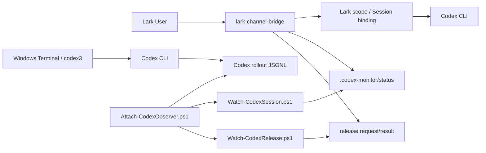

# lark-channel-bridge — Local Codex Session Handoff Extension

[English](./README.zh-CN.md) | **简体中文**

> 本仓库是在上游 `lark-channel-bridge` 基础上维护的本地增强版本，重点解决 **Windows 上运行的 Codex CLI Session 与 Lark/飞书之间的远程监控、接管（handoff）、交回（handback）和多 Session 管理**。

上游项目说明请参阅：

- [原始英文 README（已重命名保存）](./README.upstream.md)
- [上游中文 README](./README.zh.md)
- [本地文档目录](./local-docs/README.zh-CN.md)

---

## 1. 项目目的

上游 `lark-channel-bridge` 已经能够把 Lark / 飞书消息转发给本机 Claude Code 或 Codex CLI，并为不同 Chat / Group / Topic 保持独立会话。本地增强版进一步解决这样一个实际工作流：

- Codex CLI 平时在 Windows Terminal 中运行；
- 人离开电脑后，希望在手机 Lark 中查看 Session 状态；
- Windows 中的 Codex 任务完成并处于 `Waiting` 后，可安全把该 Session 接管到 Lark；
- 在 Lark 完成远程工作后，再把 Session 交回 Windows；
- 同时管理多个项目、多个 Codex Session；
- 使用不同 Lark Group 作为长期、互相隔离的 Codex 工作空间。

核心目标不是让 Windows 和 Lark 同时写同一个 Session，而是维护清晰的 **单 Writer / 单 Owner** 语义：

```text
同一个 Codex Session
       │
       ├── Windows writer
       │
       ├── Lark scope
       │
       └── Detached / 未绑定

任意时刻只允许一个逻辑 writer。
```

---

## 2. 典型使用场景

### 2.1 Windows → Lark

在 Windows 中启动 Codex：

```powershell
cd E:\AI_Tools\codex\AcuPilot
codex3
```

当 Session 完成当前任务并进入 `Waiting` 后，在对应 Lark Group 中：

```text
/local-status
/local-handoff <Thread名称或Session-ID前缀>
```

成功后 Windows writer 被安全释放，当前 Lark scope 绑定到同一个 Codex Session。下一条普通 Lark 消息会继续原 Session，而不是创建新 Session。

### 2.2 Lark → Windows

在当前 Lark Group 中：

```text
/handback
```

Bridge 会解除当前 Lark scope 对 Session 的绑定，并返回类似：

```powershell
cd 'E:\AI_Tools\codex\AcuPilot'
codex3 resume <Session-ID>
```

在 Windows 中执行即可重新接管。

### 2.3 多 Session / 多项目

推荐把 **Group 当成持久 Codex Workspace**：

```text
Spiderman's AI Assistant
│
├─ 私聊
│   └─ 临时控制台 / Session 查询
│
├─ AcuPilot Group
│   └─ AcuPilot Codex Session
│
├─ Booking-WebForms Group
│   └─ Booking Web Forms Session
│
└─ Bridge-Dev Group
    └─ Bridge 开发 Session
```

上游本身为不同 Chat / Topic 保留独立 Session；本地增强命令则提供 Windows Session ownership 与 handoff 管理。

---

## 3. 本地新增功能

### 3.1 Windows Session Observer

Windows 启动 `codex3` 后，本地脚本会发现 Codex 进程和对应 rollout，并启动只读 Observer。

主要脚本：

```text
scripts/windows/
├─ Attach-CodexObserver.ps1
├─ Watch-CodexSession.ps1
├─ Watch-CodexRelease.ps1
├─ Request-CodexRelease.ps1
├─ Release-CodexSession.ps1
├─ Stop-CodexObserver.ps1
└─ Install-CodexBridgeScripts.ps1
```

运行时目录：

```text
%USERPROFILE%\.codex-monitor\
├─ status-<SessionId>.json
├─ claims\
├─ launches\
├─ requests\
├─ results\
└─ logs\
```

### 3.2 本地新增 Lark 命令

| 命令 | 用途 |
|---|---|
| `/local-status` | 查看当前 Windows Codex Session 状态 |
| `/local-status all` | 查看活跃 + 历史 Windows monitor 状态 |
| `/local-status history` | 查看历史状态 |
| `/local-release <Session>` | 仅释放 Windows writer，不绑定 Lark |
| `/local-handoff <Session>` | Windows → 当前 Lark scope |
| `/handback` | 当前 Lark scope → Detached，准备交回 Windows |
| `/sessions` | 查看已知 Codex Session、ownership 与工作目录 |
| `/sessions all` | 查看更多历史 Session |
| `/use <Session>` | 当前 Lark scope 切换到一个 Detached Session |

> `/use` 更适合私聊中的临时 Session 切换。长期开发建议一个 Lark Group 对应一个主要 Session，通过 `/local-handoff` 和 `/handback` 双向切换。

### 3.3 Handoff 状态

`/local-status` 中新增 Handoff 状态：

```text
🟢 Ready
🔵 Busy
🟡 Needs validation
⚪ Detached
```

含义：

- **Ready**：Session 为 `Waiting`，Observer heartbeat 正常，并存在可用的 release 元数据。
- **Busy**：Windows Session 正在执行任务，不应 handoff。
- **Needs validation**：Windows Session 存在，但 TypeScript 侧无法完整预验证；最终安全判断仍由 PowerShell Release Agent 完成。
- **Detached**：Bridge 当前没有看到 Windows ownership；在 `/sessions` 的 ownership 语义中，还应结合 Lark binding 和是否为旧的 unmanaged Session 理解。

真正执行 `/local-handoff` 时，最终安全判断由：

```text
Request-CodexRelease.ps1
        ↓
Watch-CodexRelease.ps1
        ↓
Release-CodexSession.ps1
```

完成。PID、父子关系、进程创建时间等验证不依赖 Lark UI 的预检查结果。

---

## 4. 运行机制概览



更详细的原理见：

[local-docs/02-lark-bridge-codex-architecture.zh-CN.md](./local-docs/02-lark-bridge-codex-architecture.zh-CN.md)

---

## 5. 前置条件

上游当前要求：

- Node.js `>= 20.12.0`
- 已安装 Codex CLI 或 Claude Code
- 一个 Lark / 飞书 PersonalAgent
- pnpm（本仓库当前 `packageManager` 为 pnpm 10.x）

本地 Windows 扩展还需要：

- Windows PowerShell 5.1 或 PowerShell 7
- Codex CLI 可从命令行启动
- Windows 用户对自身 Codex / Observer / Release Agent 进程拥有正常访问权限

如果使用第三方 Codex API Provider，请先阅读：

[local-docs/01-codex-third-party-api-key.zh-CN.md](./local-docs/01-codex-third-party-api-key.zh-CN.md)

---

## 6. 从源码编译

在仓库目录：

```powershell
cd "$HOME\Source\lark-channel-bridge-local"
```

安装依赖：

```powershell
pnpm install
```

建议先进行检查：

```powershell
pnpm typecheck
pnpm test
pnpm build
```

上游 `package.json` 当前的标准检查也是 `pnpm test`、`pnpm typecheck`、`pnpm build`。

---

## 7. 安装本地增强版

### 7.1 安装 Windows 脚本

源码位于：

```text
scripts/windows/
```

部署到：

```text
%USERPROFILE%\Scripts\
```

运行：

```powershell
.\scripts\windows\Install-CodexBridgeScripts.ps1
```

### 7.2 全局安装本仓库构建

先构建：

```powershell
pnpm typecheck
pnpm build
```

然后从当前仓库安装：

```powershell
npm install -g .
```

> 不要在安装本地增强版后直接执行 `npm install -g lark-channel-bridge@latest` 作为升级方式，否则全局安装可能被上游包覆盖，本地新增命令会消失。

### 7.3 重启 Codex profile

```powershell
lark-channel-bridge stop --profile codex
lark-channel-bridge start --profile codex
```

查看：

```powershell
lark-channel-bridge status --profile codex
```

---

## 8. 建议的 `codex3` 隔离方式

第三方 Provider 推荐使用独立 `CODEX_HOME`：

```text
%USERPROFILE%\.codex-cli-thirdparty
```

基础 wrapper 示例：

```powershell
function codex3 {
    $oldCodexHome = $env:CODEX_HOME

    try {
        $env:CODEX_HOME = "$HOME\.codex-cli-thirdparty"
        & codex @args
    }
    finally {
        if ($null -eq $oldCodexHome) {
            Remove-Item Env:CODEX_HOME -ErrorAction SilentlyContinue
        }
        else {
            $env:CODEX_HOME = $oldCodexHome
        }
    }
}
```

本地实际部署版可在 wrapper 中额外启动 Attach detector，使新 Codex Session 自动进入 `.codex-monitor` 管理体系。

---

## 9. 日常使用

### 查看 Windows Codex Session

```text
/local-status
```

查看全部：

```text
/local-status all
```

### Windows → Lark

```text
/local-handoff Online-Web-Forms
```

或者：

```text
/local-handoff 01a0bd81
```

成功后直接发普通消息给 Codex。

### Lark → Windows

```text
/handback
```

复制返回的 `codex3 resume ...` 命令到 Windows。

### 查看 Session inventory

```text
/sessions
```

更多历史：

```text
/sessions all
```

### 临时切换 Detached Session

```text
/use Calculate 1+2
```

### 只释放 Windows，不自动让当前 Lark 接管

```text
/local-release <Session>
```

这是底层 primitive，主要用于调试、只关闭 Windows writer 或稍后从其他入口恢复的场景。

---

## 10. Attach / Observer 日志排查

日志目录：

```text
%USERPROFILE%\.codex-monitor\logs\
```

查看最新 attach log：

```powershell
$log =
    Get-ChildItem "$HOME\.codex-monitor\logs\attach-*.log" |
    Sort-Object LastWriteTime -Descending |
    Select-Object -First 1

Get-Content $log.FullName -Tail 50
```

成功 attach 通常应包含：

```text
Claimed Session ...
Observer PID=...
Release Agent PID=...
Launch mapping written: ...
Attach completed.
```

如果只看到：

```text
Codex PID=... is alive; still waiting for matching rollout Session...
```

说明 Attach 已找到 Codex 进程，但尚未匹配到正式 Session/rollout。

---

## 11. 升级上游后如何重新应用本地修改

推荐 Git remote：

```text
origin   → 你个人 GitHub fork / 仓库
upstream → https://github.com/zarazhangrui/lark-coding-agent-bridge.git
```

确认：

```powershell
git remote -v
```

### 11.1 升级前

保证当前本地增强已经提交：

```powershell
git status
git log --oneline -5
```

### 11.2 获取上游

```powershell
git fetch upstream
```

建议在独立分支处理升级：

```powershell
git switch -c local/upgrade-<version>
```

将上游 main 合并或 rebase 到当前本地分支，例如：

```powershell
git merge upstream/main
```

或按照自己的 Git 策略：

```powershell
git rebase upstream/main
```

### 11.3 冲突重点文件

本地增强目前主要涉及：

```text
scripts/windows/Attach-CodexObserver.ps1
scripts/windows/Watch-CodexSession.ps1
scripts/windows/Watch-CodexRelease.ps1
scripts/windows/Request-CodexRelease.ps1
scripts/windows/Release-CodexSession.ps1
scripts/windows/Stop-CodexObserver.ps1
scripts/windows/Install-CodexBridgeScripts.ps1

src/commands/local-status.ts
src/commands/local-handoff.ts
src/commands/local-session-manager.ts
src/commands/local-session-state.ts
src/commands/local-release.ts
src/commands/index.ts
src/card/templates.ts
src/session/store.ts
```

如果上游修改了 `src/commands/index.ts`、SessionStore、command context 或 build 结构，应优先按上游新接口重新适配，而不是机械保留旧代码。

### 11.4 升级后重新验证

```powershell
pnpm install
pnpm typecheck
pnpm test
pnpm build
```

然后重新安装本地版：

```powershell
npm install -g .
```

重新部署 Windows 脚本：

```powershell
.\scripts\windows\Install-CodexBridgeScripts.ps1
```

重启：

```powershell
lark-channel-bridge stop --profile codex
lark-channel-bridge start --profile codex
```

### 11.5 最小回归测试

建议至少验证：

```text
/local-status
/sessions
/local-handoff <test-session>
/handback
```

以及 Windows：

```powershell
codex3 resume <same-session-id>
```

确认能够完成：

```text
Windows
   ↓ /local-handoff
Lark
   ↓ /handback
Windows resume
```

的完整循环。

---

## 12. 关于 npm 升级

本仓库是一个本地 fork / 增强版。上游升级推荐：

```text
git fetch upstream
→ merge/rebase
→ resolve local patches
→ pnpm typecheck/test/build
→ npm install -g .
```

而不是：

```powershell
npm install -g lark-channel-bridge@latest
```

因为后者安装的是 registry 上游包，不包含本仓库新增的 Session monitoring / handoff 功能。

---

## 13. 安全注意事项

不要提交：

```text
API Key
Lark App Secret
.codex-monitor 运行时文件
~/.lark-channel/profiles/.../secrets.enc
包含敏感认证信息的 config
```

建议 API Key 只放在用户环境变量中。

提交前：

```powershell
git status --short --untracked-files=all
git diff --cached
```

---

## 14. 本地文档

- [Codex 使用第三方 API Key](./local-docs/01-codex-third-party-api-key.zh-CN.md)
- [Lark / Bridge / Codex 架构与运行机制](./local-docs/02-lark-bridge-codex-architecture.zh-CN.md)

---

## 15. 上游项目

本项目基于：

`zarazhangrui/lark-coding-agent-bridge`

上游 README 已保存在：

[README.upstream.md](./README.upstream.md)

升级时应优先查看上游 CHANGELOG / README / package.json 与相关源码变化，再重新应用本地增强。

