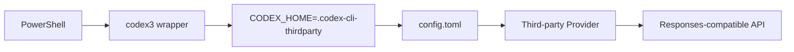

# Using a Third-Party API Key with Codex

**English** | [简体中文](./01-codex-third-party-api-key.zh-CN.md)

This document describes how to configure an isolated third-party API provider for Codex CLI on Windows without interfering with the default/OpenAI Codex environment.

> Provider names, model names, and URLs below are examples. Never commit a real API key.

---

## 1. Recommended Layout

Use a separate `CODEX_HOME`:

```text
Default Codex
%USERPROFILE%\.codex

Third-party Codex
%USERPROFILE%\.codex-cli-thirdparty
```

This isolates:

```text
config.toml
sessions / rollout
provider settings
thread index
other local Codex state
```



---

## 2. Store the API Key in a User Environment Variable

Example:

```powershell
[Environment]::SetEnvironmentVariable(
    "REQUEST_ME_API_KEY",
    "YOUR_API_KEY",
    "User"
)
```

Verify from a newly opened shell:

```powershell
Test-Path Env:REQUEST_ME_API_KEY
```

If the current shell predates the change:

```powershell
$env:REQUEST_ME_API_KEY =
    [Environment]::GetEnvironmentVariable(
        "REQUEST_ME_API_KEY",
        "User"
    )
```

Do not print the key into shared logs or screenshots.

---

## 3. Configure the Isolated `CODEX_HOME`

Create it:

```powershell
New-Item -ItemType Directory -Force "$HOME\.codex-cli-thirdparty"
```

Configuration file:

```text
%USERPROFILE%\.codex-cli-thirdparty\config.toml
```

Example:

```toml
model_provider = "aipor"
model = "gpt-5.6-sol"
model_reasoning_effort = "high"
disable_response_storage = true

[model_providers.aipor]
name = "Request Me"
base_url = "https://YOUR_PROVIDER_ENDPOINT/v1"
wire_api = "responses"
env_key = "REQUEST_ME_API_KEY"
```

Important fields:

```text
model_provider       Provider selected from [model_providers]
model                Model name exposed by that provider
model_reasoning_effort
                     Requested reasoning effort
base_url             Third-party endpoint
wire_api             Example uses the Responses API wire protocol
env_key              Environment variable containing the API key
```

---

## 4. `requires_openai_auth`

If the provider authenticates using:

```toml
env_key = "REQUEST_ME_API_KEY"
```

do not automatically add:

```toml
requires_openai_auth = true
```

unless that provider explicitly requires OpenAI login authentication in addition to its own API key.

Otherwise Codex may still request an OpenAI login even though the third-party key is configured.

---

## 5. Create a `codex3` Wrapper

Add to your PowerShell profile:

```powershell
function codex3 {
    $oldCodexHome = $env:CODEX_HOME

    try {
        $env:CODEX_HOME = "$HOME\.codex-cli-thirdparty"
        & codex @args
    }
    finally {
        if ($null -eq $oldCodexHome) {
            Remove-Item Env:CODEX_HOME -ErrorAction SilentlyContinue
        }
        else {
            $env:CODEX_HOME = $oldCodexHome
        }
    }
}
```

Use:

```powershell
codex3
codex3 resume <Session-ID>
```

---

## 6. Integration with the Local Lark Bridge Extension

The Windows monitor must use the same `CODEX_HOME` as Codex:

```text
codex3
  │
  ├─ CODEX_HOME=.codex-cli-thirdparty
  │
  ├─ Codex CLI
  │    └─ sessions/YYYY/MM/DD/rollout-....jsonl
  │
  └─ Attach detector
       ├─ session discovery
       ├─ Observer
       └─ Release Agent
```

If `codex3` uses:

```text
%USERPROFILE%\.codex-cli-thirdparty
```

then Attach/Observer must scan:

```text
%USERPROFILE%\.codex-cli-thirdparty\sessions
```

A mismatch can produce:

```text
Codex works normally
but /local-status cannot find the session
```

How Attach identifies the session `codex3` started:

- `codex3` (new session): the first rollout written in the current directory.
- `codex3 resume <Session-ID>` or `codex3 resume <thread name>`: straight from the command line, before anything is typed. A thread name is looked up in `session_index.jsonl` under the same `CODEX_HOME`, and used only if exactly one session carries it; otherwise use the Session ID.

The Observer that Attach starts exits by itself when its Codex exits, even if the terminal is closed with the X button.

---

## 7. PowerShell Profile

For Windows PowerShell 5.1, `$PROFILE` may be similar to:

```text
C:\Users\<user>\OneDrive\Documents\WindowsPowerShell\Microsoft.PowerShell_profile.ps1
```

After adding `codex3`, open a new shell and verify:

```powershell
Get-Command codex3
```

---

## 8. Verify the Active Configuration

Run:

```powershell
codex3
```

Then inspect Codex `/status`.

Check:

```text
Model
Provider
Directory
Session ID
```

If Codex still uses the old/default provider:

```powershell
$env:CODEX_HOME
Get-Content "$HOME\.codex-cli-thirdparty\config.toml"
```

---

## 9. Common Problems

### Missing environment variable

```text
Missing environment variable: REQUEST_ME_API_KEY
```

Check:

```powershell
Test-Path Env:REQUEST_ME_API_KEY
```

### Configuration changed but Codex still uses the old one

Check:

```powershell
$env:CODEX_HOME
```

Do not assume every `codex` invocation automatically uses `.codex-cli-thirdparty`.

### Official and third-party providers on one machine

Recommended:

```text
codex
→ default CODEX_HOME

codex3
→ .codex-cli-thirdparty
```

### Lark cannot see the third-party Codex session

Verify the same `CODEX_HOME` is used by:

```text
codex3
Attach-CodexObserver.ps1
Watch-CodexSession.ps1
```

---

## 10. Session Files

Typical:

```text
.codex-cli-thirdparty/
├─ config.toml
├─ session_index.jsonl
└─ sessions/
   └─ YYYY/MM/DD/
      └─ rollout-....jsonl
```

The rollout stores session events, while `session_index.jsonl` maintains thread-name/index information.

---

## 11. Security

Do not:

```text
write the key into config.toml
commit the key to Git
store it in screenshots/issues/logs
```

Prefer:

```text
User environment variable
+
config.toml only references env_key
```

---

## 12. References

- Codex config reference: https://developers.openai.com/docs/config-file/config-reference
- Codex config sample: https://developers.openai.com/docs/config-file/config-sample
- Codex source: https://github.com/openai/codex
- Project README: ../README.md
