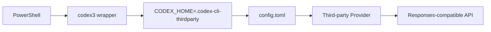

# Codex 使用第三方 API Key

[English](./01-codex-third-party-api-key.md) | **简体中文**

本文描述如何在 Windows 中为 Codex CLI 配置一个独立的第三方 API Provider，并避免与官方 Codex / ChatGPT 登录环境互相污染。

> 示例中的 Provider 名、模型名和 URL 仅用于说明。不要把真实 API Key 写入 Git。

---

## 1. 推荐架构

使用独立 `CODEX_HOME`：

```text
Official / default Codex
%USERPROFILE%\.codex

Third-party Codex
%USERPROFILE%\.codex-cli-thirdparty
```

这样可以隔离：

- `config.toml`
- session / rollout
- provider 配置
- thread index
- 其他 Codex 本地状态

逻辑如下：



---

## 2. 设置 API Key

例如 Provider 使用：

```text
REQUEST_ME_API_KEY
```

永久写入当前 Windows 用户环境变量：

```powershell
[Environment]::SetEnvironmentVariable(
    "REQUEST_ME_API_KEY",
    "YOUR_API_KEY",
    "User"
)
```

新开的 PowerShell 会读取该环境变量。

验证：

```powershell
Test-Path Env:REQUEST_ME_API_KEY
```

如果当前窗口是在设置变量之前已经打开，可以重新打开 PowerShell，或者临时加载：

```powershell
$env:REQUEST_ME_API_KEY =
    [Environment]::GetEnvironmentVariable(
        "REQUEST_ME_API_KEY",
        "User"
    )
```

不要执行：

```powershell
Write-Host $env:REQUEST_ME_API_KEY
```

到共享日志或截图中。

---

## 3. 配置独立 CODEX_HOME

创建目录：

```powershell
New-Item `
    -ItemType Directory `
    -Force `
    "$HOME\.codex-cli-thirdparty"
```

配置文件：

```text
%USERPROFILE%\.codex-cli-thirdparty\config.toml
```

示例：

```toml
model_provider = "aipor"
model = "gpt-5.6-sol"
model_reasoning_effort = "high"
disable_response_storage = true

[model_providers.aipor]
name = "Request Me"
base_url = "https://YOUR_PROVIDER_ENDPOINT/v1"
wire_api = "responses"
env_key = "REQUEST_ME_API_KEY"
```

含义：

```text
model_provider       选择下面定义的 provider
model                Provider 暴露的模型名
model_reasoning_effort
                     Codex 请求的 reasoning effort
base_url             第三方 API endpoint
wire_api             当前示例使用 Responses API 线协议
env_key              Codex 从哪个环境变量取 API Key
```

OpenAI Codex 的配置实现和公开示例支持自定义 model provider、`base_url`、`env_key` 和 `wire_api`。

---

## 4. 关于 requires_openai_auth

第三方 Provider 如果使用：

```toml
env_key = "REQUEST_ME_API_KEY"
```

通常不要同时无条件写：

```toml
requires_openai_auth = true
```

除非该 Provider 的认证流程确实要求 Codex 的 OpenAI 登录认证。

否则可能出现这样的冲突：

```text
你已经设置第三方 API Key
          +
requires_openai_auth = true
          ↓
Codex 仍要求 OpenAI auth / login
```

第三方 endpoint 的认证方式应以供应商实际要求为准。

---

## 5. 创建 codex3 wrapper

PowerShell profile 中可加入：

```powershell
function codex3 {
    $oldCodexHome = $env:CODEX_HOME

    try {
        $env:CODEX_HOME = "$HOME\.codex-cli-thirdparty"
        & codex @args
    }
    finally {
        if ($null -eq $oldCodexHome) {
            Remove-Item Env:CODEX_HOME -ErrorAction SilentlyContinue
        }
        else {
            $env:CODEX_HOME = $oldCodexHome
        }
    }
}
```

之后：

```powershell
codex3
```

等价于在独立第三方环境中启动 Codex。

Resume：

```powershell
codex3 resume <Session-ID>
```

---

## 6. 与本地 Lark Bridge 扩展一起使用

本仓库的 Windows Session monitor 需要和 Codex 使用同一个 `CODEX_HOME`。

典型结构：

```text
codex3
  │
  ├─ CODEX_HOME=.codex-cli-thirdparty
  │
  ├─ Codex CLI
  │    └─ sessions/YYYY/MM/DD/rollout-....jsonl
  │
  └─ Attach detector
       ├─ 找 Session
       ├─ Observer
       └─ Release Agent
```

如果 `codex3` 使用：

```text
%USERPROFILE%\.codex-cli-thirdparty
```

Observer / Attach 也必须扫描这个 Session root：

```text
%USERPROFILE%\.codex-cli-thirdparty\sessions
```

否则会出现：

```text
Codex 正常运行
但 /local-status 找不到 Session
```

---

## 7. 建议的 PowerShell profile

如果你使用 Windows PowerShell 5.1：

```powershell
$PROFILE
```

可能类似：

```text
C:\Users\<user>\OneDrive\Documents\WindowsPowerShell\Microsoft.PowerShell_profile.ps1
```

把 `codex3` function 放进去后，新开终端验证：

```powershell
Get-Command codex3
```

再：

```powershell
codex3
```

---

## 8. 检查 Codex 是否读取正确配置

启动：

```powershell
codex3
```

在 Codex 内查看 `/status`。

重点确认：

```text
Model
Provider
Directory
Session ID
```

如果 Provider 仍是官方或旧 Provider，优先检查：

```powershell
$env:CODEX_HOME
```

以及：

```powershell
Get-Content "$HOME\.codex-cli-thirdparty\config.toml"
```

---

## 9. 常见问题

### Missing environment variable

例如：

```text
Missing environment variable: REQUEST_ME_API_KEY
```

检查：

```powershell
Test-Path Env:REQUEST_ME_API_KEY
```

如果 User 环境变量已设置但当前进程看不到：

```powershell
$env:REQUEST_ME_API_KEY =
    [Environment]::GetEnvironmentVariable(
        "REQUEST_ME_API_KEY",
        "User"
    )
```

### 修改了 config.toml，但 Codex 仍读旧配置

检查当前 shell：

```powershell
$env:CODEX_HOME
```

不要假设所有 `codex` 启动方式都自动使用 `.codex-cli-thirdparty`。

### 同一机器官方 Provider 与第三方 Provider 共存

推荐：

```text
codex
→ 默认 CODEX_HOME

codex3
→ .codex-cli-thirdparty
```

避免不停编辑同一个 `config.toml`。

### Lark Bridge 里找不到第三方 Codex Session

检查：

```text
codex3 使用的 CODEX_HOME
Attach-CodexObserver.ps1 使用的 CodexHome
Watch-CodexSession.ps1 使用的 CodexHome
```

三者必须一致。

---

## 10. Session 文件位置

第三方 CODEX_HOME 中主要包括：

```text
.codex-cli-thirdparty/
├─ config.toml
├─ session_index.jsonl
└─ sessions/
   └─ YYYY/MM/DD/
      └─ rollout-....jsonl
```

其中：

- rollout 保存 Session 事件流；
- `session_index.jsonl` 保存 Session ID 与 Thread name 等索引信息；
- Thread name 可能有多条 append-only rename 记录，应以最新记录为准。

---

## 11. 安全建议

不要：

```text
把 API Key 写入 config.toml
把真实 Key 写进 PowerShell profile
把 Key commit 到 Git
把包含 Key 的截图或日志提交到 issue
```

推荐：

```text
User environment variable
+
config.toml 只记录 env_key 名称
```

提交前可以检查：

```powershell
git diff --cached
```

---

## 12. 参考

- OpenAI Codex repository: https://github.com/openai/codex
- Codex CLI documentation: https://developers.openai.com/codex/cli
- 本仓库根 README: ../README.zh-CN.md
