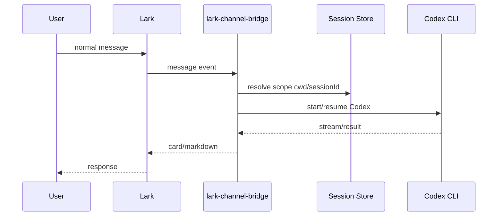
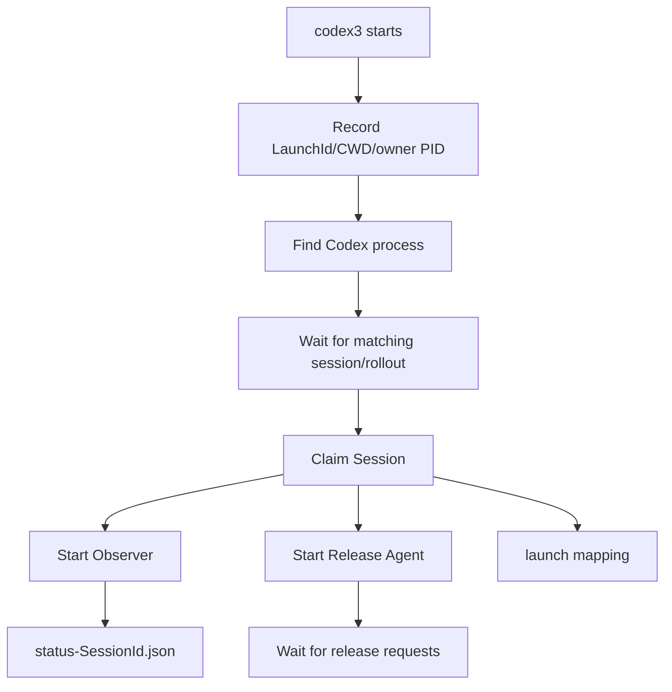
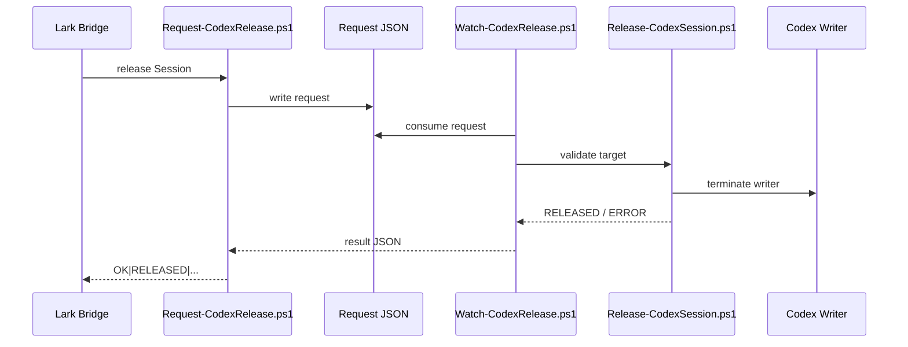

# Lark, lark-channel-bridge, and Codex Architecture

**English** | [简体中文](./02-lark-bridge-codex-architecture.md)

This document explains how Lark, `lark-channel-bridge`, Codex CLI, the Windows Observer, the Release Agent, and persistent Codex sessions work together in this local extension.

---

## 1. Major Components

### Lark / Feishu

The user-facing transport:

```text
Direct Message
Group
Topic
Document/comment thread
```

Different chats/groups can form independent bridge scopes.

### lark-channel-bridge

Responsibilities include:

```text
receive Lark events
maintain scope → cwd/session bindings
start or resume Codex runs
stream output back to Lark
persist profile/workspace/session state
handle local commands such as /sessions and /local-handoff
```

### Codex CLI

The actual coding agent that reads/writes files, executes tools, and maintains persistent thread/session context.

### Windows Monitor / Handoff Layer

Local extension:

```text
Attach-CodexObserver.ps1
Watch-CodexSession.ps1
Watch-CodexRelease.ps1
Release-CodexSession.ps1
```

It observes already-running Windows Codex sessions and provides safe writer release.

---

## 2. Normal Lark → Codex Flow



---

## 3. Why Lark Groups Matter

One bot/agent can serve multiple chats:

```text
Agent
├─ Direct Message scope A
├─ AcuPilot Group scope B
├─ Booking Group scope C
└─ Bridge-Dev Group scope D
```

Each scope can retain:

```text
cwd
sessionId
agent kind
```

For long-running development, a group effectively acts like a persistent workspace/bookmark.

---

## 4. Codex Session Persistence

Example third-party home:

```text
%USERPROFILE%\.codex-cli-thirdparty\
```

Important files:

```text
session_index.jsonl

sessions/
└─ YYYY/MM/DD/
   └─ rollout-<timestamp>-<SessionId>.jsonl
```

Rollout is an event log. Observed event types include:

```text
session_meta
turn_context
event_msg
response_item
token_usage_record
world_state
```

`session_index.jsonl` is especially useful for thread names and rename history.

For deeper details, see:

[03-codex-session-management.en.md](./03-codex-session-management.en.md)

---

## 5. Windows Process Model

Typical tree:

```text
powershell.exe
└─ node.exe
   └─ codex.exe
```

Additional helper processes run separately:

```text
Watch-CodexSession.ps1
Watch-CodexRelease.ps1
```

Design rule:

```text
Never kill the owner PowerShell / Windows Terminal.
Release only the Codex writer.
```

---

## 6. Attach Lifecycle



A newly opened Codex TUI may exist before a persistent rollout/session has been created. Such a process is best considered a **Pending Launch**, not yet a fully discovered session.

---

## 7. Observer

The Observer is read-only.

It reads rollout/session metadata and writes:

```text
%USERPROFILE%\.codex-monitor\status-<SessionId>.json
```

Typical fields:

```json
{
  "sessionId": "...",
  "threadName": "...",
  "projectName": "AcuPilot",
  "cwd": "E:\\AI_Tools\\codex\\AcuPilot",
  "model": "gpt-5.6-sol",
  "reasoningEffort": "xhigh",
  "modelProvider": "aipor",
  "state": "Waiting",
  "observerState": "Running",
  "observerPid": 12345
}
```

`Observer: Running` means the watcher is alive. `state=Waiting` means the current Codex turn has completed and is waiting for new input. These are independent dimensions.

---

## 8. Release Agent

The Attach process also starts:

```text
Watch-CodexRelease.ps1
```

The bridge does not directly kill the Windows Codex process. Instead it submits a local request:



The PowerShell layer performs the authoritative safety validation.

---

## 9. `.codex-monitor`

Typical layout:

```text
.codex-monitor/
├─ status-<SessionId>.json
├─ claims/
├─ launches/
├─ requests/
├─ results/
└─ logs/
```

Launch metadata can include:

```text
launchId
sessionId
cwd
codexHome
ownerPowerShellPid
codexRootPid
observerPid
releaseAgentPid
attachedAt
```

---

## 10. Windows → Lark Handoff

```text
/local-handoff <Thread-name-or-Session-ID-prefix>
```

```mermaid
flowchart TD
    A[/local-handoff] --> B[Resolve unique Session]
    B --> C{Bound to another Lark scope?}
    C -- Yes --> X[Reject: handback from original scope]
    C -- No --> D{Windows session busy?}
    D -- Yes --> Y[Reject: wait for current turn]
    D -- No --> E[Request-CodexRelease]
    E --> F{PowerShell release successful?}
    F -- No --> Z[Do not alter Lark binding]
    F -- Yes --> G[Set scope cwd]
    G --> H[Set scope sessionId]
    H --> I[Next normal Lark message resumes the same Session]
```

The order must be:

```text
release Windows successfully
        ↓
bind Lark
```

not the reverse.

---

## 11. Lark → Windows Handback

```text
/handback
```

This removes the current scope/session binding but preserves Codex history, then returns a Windows resume command.

---

## 12. `/sessions`

The session inventory combines:

```text
Codex session_index
rollout metadata
Windows monitor state
Lark scope bindings
```

Potential owner states:

```text
Windows
Lark · Current
Lark · another scope/group
Detached
Unknown / Unmanaged
```

An older Windows TUI that was never attached to the new monitor may be **Unknown / Unmanaged**, even though the Codex process is visibly running.

---

## 13. `/use`

`/use <Session>` binds the current Lark scope to an already Detached session. It should not terminate a Windows writer.

If the target is Windows-owned, use:

```text
/local-handoff
```

---

## 14. `/local-release`

A lower-level primitive:

```text
release Windows writer
do not automatically bind the current Lark scope
```

Useful for debugging or when another client will resume the session later.

---

## 15. Handoff State

Treat it as a UI pre-check, not the final safety authority:

```text
🟢 Ready
🔵 Busy
🟡 Needs validation
⚪ Detached
```

The PowerShell release chain performs final validation.

---

## 16. Repeated Ownership Transfers

Target lifecycle:

```text
Windows
   │
   │ /local-handoff
   ▼
Lark Group
   │
   │ /handback
   ▼
Detached
   │
   │ codex3 resume
   ▼
Windows
```

This can repeat while preserving the same session history.

---

## 17. Troubleshooting

Latest Attach log:

```powershell
$log =
    Get-ChildItem "$HOME\.codex-monitor\logs\attach-*.log" |
    Sort-Object LastWriteTime -Descending |
    Select-Object -First 1

Get-Content $log.FullName -Tail 50
```

Healthy attach:

```text
Codex process discovered...
Claimed Session ...
Observer PID=...
Release Agent PID=...
Launch mapping written...
Attach completed.
```

---

## 18. Upstream vs Local Extension

Upstream:

```text
Lark transport
PersonalAgent
per-chat/topic sessions
workspaces
agent adapters
streaming UI
access control
service management
```

Local extension:

```text
Windows Codex TUI discovery
rollout observer
release agent
Windows ownership
handoff / handback
cross-scope session inventory
```

Keeping this boundary clear makes upstream upgrades easier.

---

## 19. References

- Upstream project: https://github.com/zarazhangrui/lark-coding-agent-bridge
- Codex CLI: https://developers.openai.com/codex/cli
- Codex App Server: https://developers.openai.com/docs/app-server
- Codex source: https://github.com/openai/codex
- Session internals: [03-codex-session-management.en.md](./03-codex-session-management.en.md)
