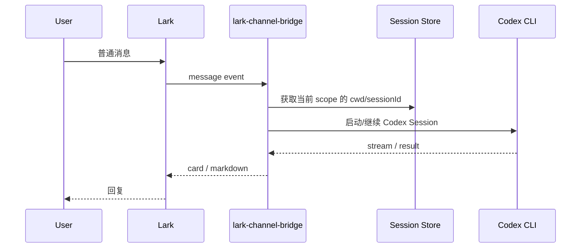
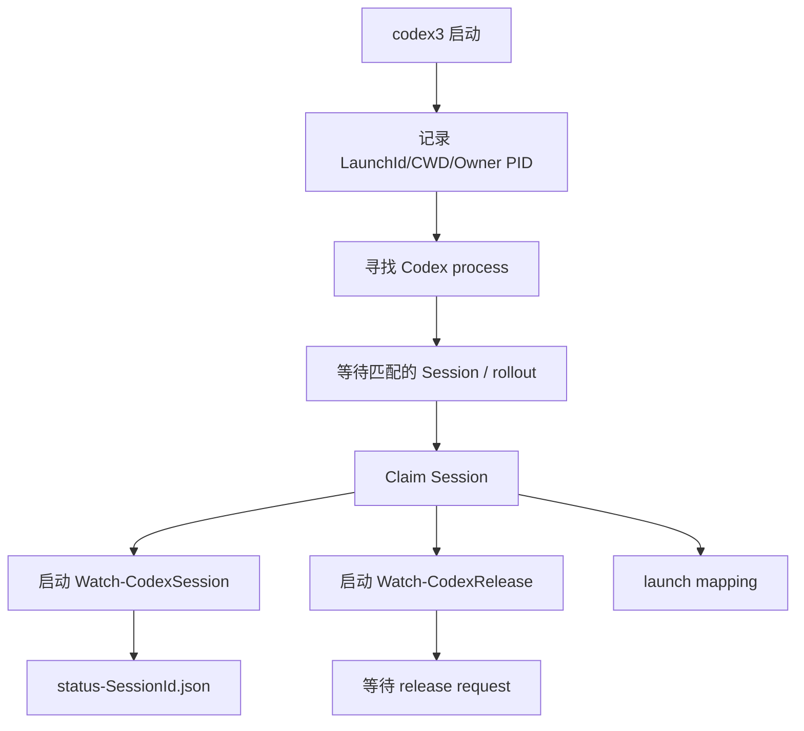
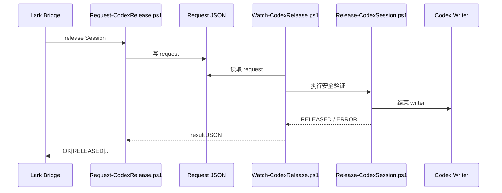

# Lark、lark-channel-bridge 与 Codex 的架构和运行机制

[English](./02-lark-bridge-codex-architecture.md) | **简体中文**

本文总结本地增强版中 Lark、`lark-channel-bridge`、Codex CLI、Windows Observer、Release Agent 和 Session storage 之间的关系。

---

## 1. 四个主要组件

### Lark / 飞书

负责用户交互：

```text
私聊
Group
Topic
文档评论
```

对本地增强工作流而言，最重要的是 **不同 Chat / Group 可以形成不同 scope**。

### lark-channel-bridge

Bridge 负责：

- 接收 Lark 消息；
- 维护 scope → cwd / Session 绑定；
- 启动 Codex agent run；
- 将输出回传 Lark；
- 保存 profile / workspace / session state；
- 执行本地新增的 `/sessions`、`/local-handoff`、`/handback` 等命令。

### Codex CLI

Codex 是真正读写代码、执行工具和维护 Thread / Session 上下文的本地 coding agent。

### Windows monitor / handoff layer

本地增强层：

```text
Attach-CodexObserver.ps1
Watch-CodexSession.ps1
Watch-CodexRelease.ps1
Release-CodexSession.ps1
```

用于监控 Windows TUI 中已经存在的 Codex Session，并实现安全释放。

---

## 2. 普通 Lark → Codex 消息流



上游 Bridge 的核心能力之一就是不同 Chat / Topic 保持独立会话。

---

## 3. 为什么 Group 很重要

一个 Bot / Agent 可以同时服务多个 Lark Chat。

概念上：

```text
Agent
├─ 私聊 scope A
├─ AcuPilot Group scope B
├─ Booking Group scope C
└─ Bridge-Dev Group scope D
```

每个 scope 可以保存自己的：

```text
cwd
sessionId
agent kind
```

因此对多项目长期工作，Group 可以理解成：

```text
Windows Terminal Tab
+
VS Code Workspace
+
Codex Session bookmark
```

推荐：

```text
私聊
→ 临时查询 / 管理

AcuPilot Group
→ 长期绑定 AcuPilot Session

Booking-WebForms Group
→ 长期绑定 Web Forms Session

Bridge-Dev Group
→ 长期绑定 Bridge 开发 Session
```

---

## 4. Codex Session 的持久化

Codex 第三方环境示例：

```text
%USERPROFILE%\.codex-cli-thirdparty\
```

主要 Session 数据：

```text
session_index.jsonl

sessions/
└─ YYYY/
   └─ MM/
      └─ DD/
         └─ rollout-<timestamp>-<SessionId>.jsonl
```

### rollout JSONL

rollout 是 Session 的事件流。

实际观察到的顶层类型包括：

```text
session_meta
turn_context
event_msg
response_item
token_usage_record
world_state
```

常见信息：

```text
session_meta
→ session_id
→ cwd
→ cli_version
→ model_provider

turn_context
→ model
→ approval_policy
→ cwd
→ personality

thread_settings_applied
→ model
→ model_provider_id
→ reasoning_effort
→ permission_profile

token_usage_record
→ input/output/total/context usage
```

### session_index.jsonl

Thread name 不一定写在 rollout 中，而是可以从：

```text
session_index.jsonl
```

获取。

同一个 Session ID 可能有多个 rename 记录，应选择最新 `updated_at`。

---

## 5. Windows Codex 进程模型

典型 Windows 进程树：

```text
powershell.exe
└─ node.exe
   └─ codex.exe
```

其中：

- owner PowerShell 是用户实际打开的 Terminal shell；
- Node 是 Codex CLI wrapper；
- native `codex.exe` 执行实际 CLI；
- Observer 和 Release Agent 是独立 PowerShell 进程。

设计原则：

```text
Release 不杀 Windows Terminal
Release 不杀 owner PowerShell
优先结束 Codex writer
```

这样 handoff 后原 Terminal 仍然保留。

---

## 6. Attach 机制

`codex3` 启动时可同时启动：

```text
Attach-CodexObserver.ps1
```

逻辑：



新 Session 在第一次真正创建 rollout 之前，可能只有 Codex process 而没有正式 Session ID，因此 `/sessions` 未必能立即显示。

---

## 7. Observer

Observer 是只读监控器。

它读取 rollout 和 session index，写：

```text
%USERPROFILE%\.codex-monitor\status-<SessionId>.json
```

典型字段：

```json
{
  "sessionId": "...",
  "threadName": "...",
  "projectName": "AcuPilot",
  "cwd": "E:\\AI_Tools\\codex\\AcuPilot",
  "model": "gpt-5.6-sol",
  "reasoningEffort": "xhigh",
  "modelProvider": "aipor",
  "state": "Waiting",
  "observerState": "Running",
  "observerPid": 12345
}
```

Observer `Running` 表示：

```text
监控进程活着
```

而 `state=Waiting` 表示：

```text
当前 Codex turn 已完成，正在等待用户输入
```

两者并不冲突。

---

## 8. Release Agent

Attach 完成后还会启动：

```text
Watch-CodexRelease.ps1
```

这是同用户上下文的本地 Release Agent。

为什么不是让 Lark Bridge 直接 kill Codex？

因为实际调试中，Bridge 直接结束 Windows TUI 相关进程可能遇到：

```text
Access denied
PID / parent ambiguity
误杀 owner shell 风险
```

因此采用 request-based 架构：



最终安全验证由 PowerShell 完成，包括：

```text
PID
parent PID
creation time
process identity
Session / launch mapping
```

---

## 9. `.codex-monitor` 目录

典型结构：

```text
.codex-monitor/
├─ status-<SessionId>.json
├─ claims/
│  └─ <SessionId>.claim
├─ launches/
│  └─ <LaunchId>.json
├─ requests/
│  └─ release-<RequestId>.json
├─ results/
│  └─ release-<RequestId>.json
└─ logs/
   ├─ attach-<LaunchId>.log
   └─ observer-<SessionId>.log
```

launch mapping 通常包含：

```text
launchId
sessionId
cwd
codexHome
ownerPowerShellPid
codexRootPid
observerPid
releaseAgentPid
attachedAt
```

---

## 10. Windows → Lark Handoff

命令：

```text
/local-handoff <Thread名称或Session-ID前缀>
```

推荐逻辑：

```mermaid
flowchart TD
    A[/local-handoff] --> B[解析唯一 Session]
    B --> C{已经绑定到其他 Lark scope?}
    C -- Yes --> X[拒绝: 先在原 scope handback]
    C -- No --> D{Windows Session Busy?}
    D -- Yes --> Y[拒绝: 等待 turn 完成]
    D -- No --> E[Request-CodexRelease]
    E --> F{PowerShell release 成功?}
    F -- No --> Z[不修改 Lark binding]
    F -- Yes --> G[设置当前 scope cwd]
    G --> H[设置当前 scope sessionId]
    H --> I[下一条普通消息继续同一 Session]
```

关键顺序必须是：

```text
Windows release 成功
        ↓
Lark binding
```

不能反过来，否则失败时会形成双 owner。

---

## 11. Lark → Windows Handback

命令：

```text
/handback
```

作用：

```text
当前 Lark scope 解除 session binding
        ↓
Session 历史保留
        ↓
返回 Windows resume 命令
```

例如：

```powershell
cd 'E:\AI_Tools\codex\AcuPilot'
codex3 resume 01a0...
```

Handback 不删除 Codex Session。

---

## 12. `/sessions`

`/sessions` 聚合：

```text
Codex session_index
+
rollout metadata
+
Windows monitor status
+
Lark scope bindings
```

输出可以包括：

```text
Thread
Project
Session ID
Owner
Handoff 状态
cwd
更新时间
```

Owner 的目标语义：

```text
Windows
Lark · Current
Lark · <other scope/group>
Detached
Unknown / Unmanaged
```

其中旧 Session 如果在 Windows TUI 中运行、但从未被新版 Attach/Observer 接管，Bridge 可能无法证明 Windows ownership。这类情况更准确的语义应是 `Unknown / Unmanaged`，而不是简单等同于 Detached。

---

## 13. `/use`

`/use <Session>` 只做：

```text
当前 Lark scope
    ↓
绑定一个 Detached Session
```

它不应该主动结束 Windows writer。

如果目标仍由 Windows 控制，应该使用：

```text
/local-handoff
```

因此 `/use` 的主要场景是：

```text
Bot 私聊里临时切换历史 / Detached Session
```

长期开发更推荐 Group。

---

## 14. `/local-release`

`/local-release` 是底层 primitive：

```text
只 release Windows writer
不把当前 Lark scope 自动绑定到该 Session
```

用途：

```text
调试 Release Agent
只想关闭 Windows writer
稍后从其他 Group / Windows / 客户端 resume
```

日常 Windows → Lark 更推荐 `/local-handoff`。

---

## 15. Handoff 状态

推荐理解为 UI 预检查，而不是最终安全裁决：

```text
🟢 Ready
Windows Session Waiting，Observer fresh，并存在 release 元数据

🔵 Busy
当前 Codex turn 仍在执行

🟡 Needs validation
Bridge 看到 Windows Session，但本地 metadata 不完整，
仍需由 PowerShell release 链做最终验证

⚪ Detached
Bridge 当前没有看到 Windows ownership
```

真正执行 release 时，以 PowerShell validator 为准。

---

## 16. 一个 Session 多次来回切换

支持的目标生命周期：

```text
Windows
   │
   │ /local-handoff
   ▼
Lark Group
   │
   │ /handback
   ▼
Detached
   │
   │ codex3 resume
   ▼
Windows
```

可以重复多次。

Session ID 不变，writer / Observer / release Agent 可以在每次 Windows resume 时重新建立。

---

## 17. Attach 日志

查看最近 attach：

```powershell
$log =
    Get-ChildItem "$HOME\.codex-monitor\logs\attach-*.log" |
    Sort-Object LastWriteTime -Descending |
    Select-Object -First 1

Get-Content $log.FullName -Tail 50
```

正常：

```text
Codex process discovered...
Claimed Session ...
Observer PID=...
Release Agent PID=...
Launch mapping written...
Attach completed.
```

---

## 18. 常见故障模型

### Observer Running，但 release timeout

可能：

```text
Observer 手工启动
但 Release Agent 没启动
```

所以：

```text
/local-status 能工作
/local-release timeout
```

### Session 在 Windows TUI 运行，但 `/sessions` 看成 Detached

可能是旧的 unmanaged Session：

```text
Codex writer 存在
但没有新版 status / launch mapping
```

重新正常退出并：

```powershell
codex3 resume <Session-ID>
```

可让新版 Attach 重新接管。

### 新启动 `codex3` 没有任何 prompt 时 `/sessions` 不显示

原因：

```text
process 已存在
但正式 Session ID / rollout 尚未建立
```

这是 Pending Launch，不一定已经能作为正式 Session inventory 条目。

---

## 19. 上游与本地增强的边界

上游负责：

```text
Lark transport
PersonalAgent
per-chat/topic session
workspace
agent adapter
streaming UI
access control
service management
```

本地增强负责：

```text
Windows Codex TUI discovery
rollout observer
release agent
Windows ownership
handoff / handback
cross-scope session inventory
```

升级时应尽量保持这个边界，减少和上游核心代码冲突。

---

## 20. 参考

- 上游项目：https://github.com/zarazhangrui/lark-coding-agent-bridge
- 上游 README：../README.upstream.md
- Codex CLI：https://developers.openai.com/codex/cli
- Codex source：https://github.com/openai/codex
- 本仓库第三方 API 文档：./01-codex-third-party-api-key.zh-CN.md
