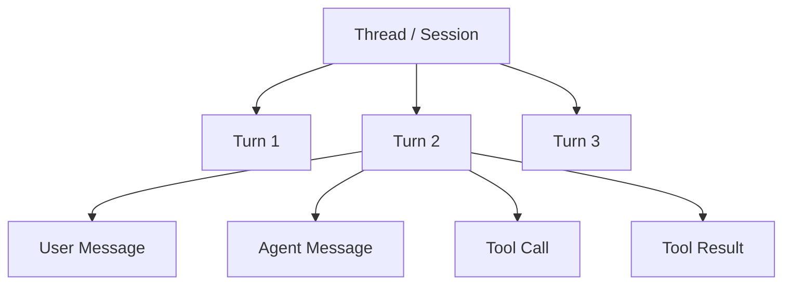
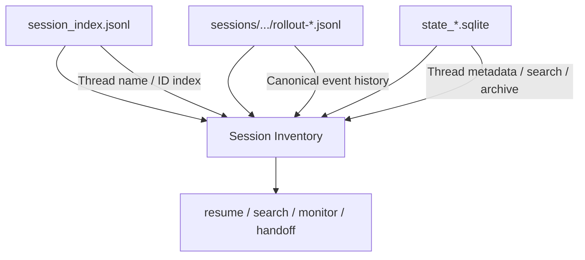
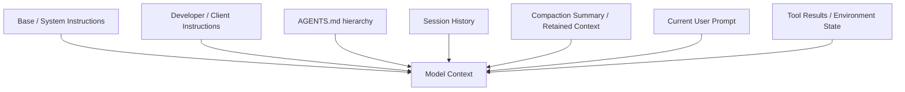
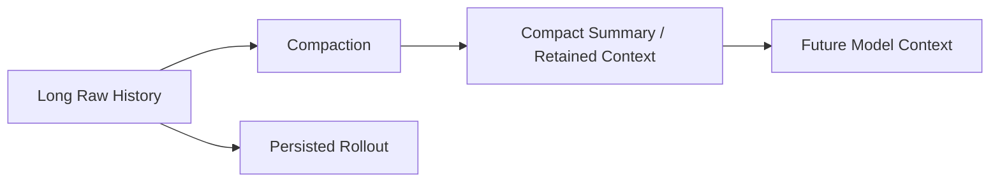
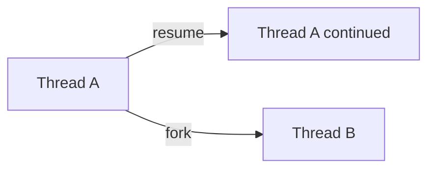
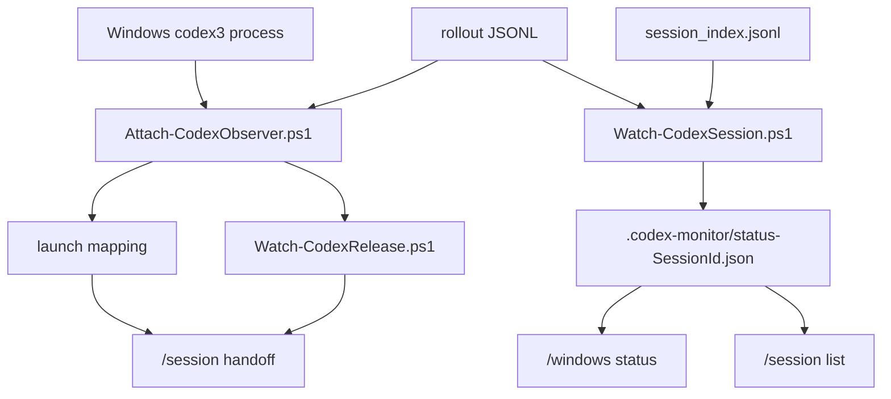

# Codex Session / Thread Management and Local Storage Reference

**English** | [简体中文](./03-codex-session-management.zh-CN.md)

> Purpose: document the core mechanics behind Codex CLI/App Server sessions (threads), persistence, resume, prompts, context, token usage, compaction, and local files. It also records how this project actually used those artifacts while building Windows monitoring and Lark handoff, so future session-management, migration, search, monitoring, analytics, and recovery features can build on a consistent mental model.
>
> This document combines:
>
> - **Project observations** from Windows + Codex CLI 0.155.x with an isolated `CODEX_HOME`.
> - **Public Codex implementation/documentation** from OpenAI's Codex docs and the `openai/codex` repository. Internal storage formats can evolve and should not be treated as permanent public APIs.

---


## Current session command model

```text
Lark Scope      → /lark status | /lark new | /lark resume
Windows Runtime → /windows status | /windows release
Global Sessions → /session list | /session use | /session handoff | /session handback
```

Legacy command names remain compatibility aliases, but this document uses the grouped names for project-level session management.

---

## 1. Core Terms: Thread / Session / Turn / Item

Different Codex surfaces use slightly different terminology:

```text
What a user thinks of as "one chat"
        │
        ├── CLI often calls it a saved chat/session
        ├── App Server primarily calls it a Thread
        └── rollout data may contain session_id / thread_id / turn_id
```

This project calls the persistent UUID used to identify/resume a long-lived conversation the **Session ID**, for example:

```text
01a0beb6-d86e-70c0-8607-e4309012ba49
```

The App Server generally calls the same logical object a **Thread**.

A Thread contains Turns. A Turn is one user request plus the work triggered by it. A Turn contains Items such as user messages, agent messages, command execution, and tool calls.



This project adds a separate **Writer / Owner** abstraction:

```text
One Session
   │
   ├─ Windows Codex TUI
   └─ Lark scope

Only one logical writer should own the Session at a time.
```

That ownership layer is project-specific, not part of Codex's native persistence format.

### Remote control surface: Lark Mobile App and Lark Web

The local bridge now exposes Session management through interactive Lark cards, not only text commands. This is intended to make remote operation practical from both **Lark Mobile App** and **Lark Web**:

```text
/lark status
→ current Lark scope + quick actions

/windows status
→ Windows runtime sessions + Release actions

/session list
→ global inventory + Use / Handoff / Hand Back actions
```

Action labels are human-readable, but execution remains Session-ID based:

```text
Display: unique Thread Name
         duplicate Thread Name + short Session ID
         short Session ID when unnamed

Target:  exact full Session ID
```

Project name and cwd are metadata only and must not be used as action identities because several Sessions can share the same project directory. This distinction is especially important on mobile, where buttons replace long manual selectors. Lark Web/Desktop can additionally show `hover_tips`; mobile clients rely on the visible button text.

---

## 2. `CODEX_HOME`: Root of Local State

Default Codex state typically lives under:

```text
~/.codex
```

This project uses an isolated third-party provider home such as:

```text
C:\Users\<user>\.codex-cli-thirdparty
```

selected through:

```powershell
$env:CODEX_HOME = "$HOME\.codex-cli-thirdparty"
```

A representative layout:

```text
$CODEX_HOME/
├─ config.toml
├─ AGENTS.md
├─ session_index.jsonl
├─ sessions/
│  └─ YYYY/MM/DD/
│     └─ rollout-...-<SessionId>.jsonl
├─ archived_sessions/                # version/client dependent
├─ state_*.sqlite                    # newer thread metadata/state
├─ logs_*.sqlite                     # version dependent
├─ memories_*.sqlite                 # may exist in some builds/clients
├─ auth.json                         # may exist in OpenAI-auth environments
└─ other cache/runtime files
```

Do not assume every release exposes every file. Prefer capability detection over hard-coded presence assumptions.

---

## 3. Three Major Session Data Planes



For this project:

- rollout JSONL is the most important history source;
- `session_index.jsonl` is especially useful for thread names;
- `state_*.sqlite` is not yet a hard dependency, but is promising for future high-performance session management.

---

## 4. `rollout-*.jsonl`: The Most Important Event History

Example:

```text
$CODEX_HOME\sessions\2026\09\20\
rollout-2026-09-20T05-07-30-01a0beb6-....jsonl
```

Each line is an independent JSON object.

### How this project used rollout data

```text
discover new sessions
obtain Session ID
obtain cwd
read CLI version
read model/provider
read approval/permission metadata
infer Working/Waiting
read token/context usage
observe task_started/task_complete
```

### Event types observed in Codex CLI 0.155.x

```text
session_meta
turn_context
event_msg
response_item
token_usage_record
world_state
```

The Codex implementation may also persist or interpret items such as:

```text
Compacted
RetainedContext
WorldState
RealtimeItem
InterAgentCommunication
```

Parsers should therefore be forward-compatible:

```typescript
switch (item.type) {
  case 'session_meta':
  case 'turn_context':
  case 'event_msg':
    // parse known data
    break;
  default:
    // preserve or ignore unknown data
    break;
}
```

Never treat the currently observed event set as a permanent schema.

---

## 5. `session_meta`: Initial Thread Identity

Fields observed by this project include:

```text
session_id
id
timestamp
cwd
originator
cli_version
source
thread_source
model_provider
base_instructions
history_mode
context_window
git
```

Useful questions:

```text
Which Session owns this rollout?
What was the starting cwd?
Which CLI version created it?
Where did the Thread originate?
What provider/base instructions were active initially?
```

### `cwd` is critical

A reliable handoff needs at least:

```text
Session ID
+
cwd
```

Resuming a valid Session ID in the wrong project directory can still produce an incorrect working environment.

### Preserve `source`

Sessions can originate from different clients/surfaces. Pickers and lists may filter by source. The existence of a rollout file does not guarantee a default UI picker will display that thread.

For programmatic recovery, stable Thread/Session ID is preferable.

---

## 6. `turn_context`: Per-Turn Execution Snapshot

Observed fields include:

```text
turn_id
root_turn_id
cwd
workspace_roots
current_date
timezone
approval_policy
approvals_reviewer
sandbox_policy
permission_profile
model
comp_hash
personality
collaboration...
```

It answers:

> Under what model, directory, permissions, time, and collaboration mode did this Turn run?

Do not use only initial `session_meta` for "current session state". Settings can change later.

Recommended aggregation:

```text
session_meta initial values
        ↓
latest turn_context
        ↓
latest thread_settings_applied
        ↓
newer values override older ones
```

This is the same general strategy used by this project's `Watch-CodexSession.ps1`.

---

## 7. `thread_settings_applied`

Observed inside `event_msg`, with settings such as:

```text
model
model_provider_id
reasoning_effort
approval_policy
permission_profile
cwd
personality
collaboration_mode
```

For a status UI, the latest applied settings are often more useful than the initial metadata.

---

## 8. `session_index.jsonl`: Thread Name Index

Example:

```json
{
  "id": "01a0...",
  "thread_name": "Online-Web-Forms",
  "updated_at": "2026-09-19T21:41:25.9104746Z"
}
```

Important behavior:

```text
append-only
one Session ID may have multiple rename records
latest updated_at / latest append wins
```

Wrong:

```text
stop at the first matching Session ID
```

Correct:

```text
scan all records for that ID
→ choose the latest
```

On Windows PowerShell 5.1, read it explicitly as UTF-8 to avoid mojibake for non-ASCII names.

In this project:

```text
rollout
→ Session ID / cwd / state / model / usage

session_index.jsonl
→ Thread name
```

---

## 9. `state_*.sqlite`: Important for Future Session Managers

This project does not currently require the state DB, but newer Codex clients increasingly rely on a state database for thread metadata, search, archive state, and listing behavior.

Potential future uses:

```text
high-performance /session list
hundreds/thousands of Thread searches
pagination
filters by cwd/source/provider
archived sessions
thread title/preview
fast Recent lists
```

### Why it is not a hard dependency today

```text
rollout + session_index
```

already provide enough information for:

```text
Windows discovery
Observer
thread names
cwd
model
usage
handoff
```

Direct coupling to internal SQLite schemas increases upgrade risk.

### Recommendation

Prefer read-only access. Avoid manually writing the DB unless the current Codex schema and synchronization rules are fully understood.

---

## 10. A Prompt Is Not One String

A model request is better understood as layered context:



A Prompt Inspector should not assume "user prompt + assistant response" is the complete model input.

---

## 11. Base / System Instructions

This project observed:

```text
base_instructions
```

inside `session_meta`.

It can help answer:

```text
Which base instructions were active at session creation?
Did a Codex version/mode change the base prompt?
```

But it should not be treated as the complete set of system/developer context. Additional inputs may include:

```text
AGENTS.md
developer instructions
sandbox/permission instructions
tool schemas
dynamic environment state
history
compaction summaries
```

---

## 12. `AGENTS.md`: Persistent Project Instructions

Codex officially supports a layered discovery model including:

```text
$CODEX_HOME/AGENTS.md
repository-root AGENTS.md
nested AGENTS.md / AGENTS.override.md
```

Instructions are assembled from the project root toward the current working directory, with more local rules appearing later and therefore taking precedence.

Good uses:

```text
test commands
coding style
repository constraints
deployment rules
team workflow
```

Do not use AGENTS as a dumping ground for one-off session state.

If two identical user prompts behave differently, inspect both:

```text
cwd
+
AGENTS instruction chain
```

---

## 13. User Prompts, Response Items, and Transcript Reconstruction

User input and assistant/tool output are represented as session items/events.

`response_item` may correspond to:

```text
assistant messages
tool/function interactions
Responses API items
```

A rollout is a machine event log, not a ready-to-display Markdown transcript.

Build a transcript through:

```text
RolloutItem
→ normalize
→ filter internal-only items
→ map to user / assistant / tool timeline
```

---

## 14. Reasoning and Private-Reasoning Boundaries

A session inspector should distinguish:

```text
persisted events
≠ complete model-visible context
≠ content suitable for user display
```

Stable product features should rely on:

```text
user messages
assistant messages/finals
tool calls/results
turn metadata
reasoning summaries (when supported)
compaction summaries
```

Do not assume full internal chain-of-thought is persisted in plaintext or should be exposed.

---

## 15. Context Compaction

Long sessions do not indefinitely resend the full raw history.

Codex supports:

```text
/compact
automatic compaction
```

Conceptually:



Key distinction:

```text
full history persisted on disk
```

is not the same as:

```text
effective context sent to the model on the next turn
```

A replay tool should not blindly concatenate every rollout line into a future model request.

---

## 16. `Compacted`, `RetainedContext`, and `WorldState`

These are important for advanced tools.

### `Compacted`

Signals that historical context was compacted.

### `RetainedContext`

Represents context retained for future model calls after compaction.

### `WorldState`

Relates to environment/workspace state used by persistence or reconstruction.

Main lesson:

> "Show full history" and "reconstruct model context" are two different problems.

---

## 17. Context Window and Auto-Compaction Thresholds

Codex configuration supports values such as:

```toml
model_context_window = 128000
model_auto_compact_token_limit = 64000
```

If omitted, model metadata/defaults are used.

External tools should not hard-code assumptions like:

```text
this model is always 128K
compaction always happens at exactly X%
```

Both models and Codex implementations evolve.

---

## 18. Context Percentage: Do Not Simply Compute `used / total`

During this project, a rollout could show approximately:

```text
13.7K tokens
258K context window
```

A simple ratio suggests roughly:

```text
95% left
```

while Codex TUI may display a value closer to:

```text
99% left
```

Codex UI/context accounting can apply a different effective-window/baseline model, and compaction may trigger a context recomputation.

Therefore:

> If exact parity with Codex `/status` matters, do not derive the percentage solely from cumulative thread usage divided by context window.

Reuse the current Codex accounting logic when possible.

---

## 19. `token_usage_record`

Observed fields include:

```text
thread_id
turn_id
session_id
root_turn_id
response_id
usage
turn_token_usage
thread_token_usage
```

Typical usage dimensions:

```text
input_tokens
cached_input_tokens
output_tokens
reasoning_output_tokens
total_tokens
```

The same record family can expose:

```text
response usage
turn cumulative usage
thread cumulative usage
```

---

## 20. Current Context, Cumulative Usage, and Billing Are Different

This distinction is essential:

```text
current effective context
≠ thread cumulative tokens
≠ final API bill
```

A thread can accumulate millions of tokens over many turns while the current model context is much smaller because of compaction.

Conversely, a 50K current context does not mean the thread only consumed 50K tokens overall.

---

## 21. Token Usage and Cost Estimation

Rollout usage can support **estimates**, not necessarily an authoritative invoice.

A cost estimator needs:

```text
input
cached input
output
model
provider
service tier
provider-specific pricing
```

Third-party providers especially require usage and pricing to be separated:

```text
TokenUsageRecord
       +
Model
       +
Provider
       +
Price Table
       ↓
Estimated Cost
```

Use OpenAI's pricing page only for OpenAI-billed traffic; third-party providers may price differently.

---

## 22. Rate Limits / Quota Are Also Separate

A dashboard should distinguish:

```text
Context Window
Current Context Usage
Thread Cumulative Usage
Estimated Cost
Rate Limit
Subscription / Provider Quota
```

"Context 90% left" does not imply "API quota 90% left."

---

## 23. Resume: Persist Stable Thread/Session ID

CLI supports:

```text
codex resume
codex resume <Thread-ID>
```

App Server exposes:

```text
thread/start
thread/resume
thread/fork
thread/read
thread/list
```

The App Server documentation treats the Thread as the primary conversation primitive.

For handoff metadata, preserve at minimum:

```text
Session / Thread ID
cwd
```

A rollout path can be diagnostic/fallback metadata, but normal recovery should not depend too heavily on a filesystem path.

---

## 24. Resume vs Fork

```text
resume
→ continue appending to the original Thread

fork
→ derive a new Thread ID from existing history
```



If a future Lark feature needs an experimental branch from the current session, use fork semantics rather than copying rollout files.

---

## 25. `thread/read` / `thread/list`: A Better Long-Term Direction

Codex App Server already provides:

```text
thread/read
thread/list
```

which can inspect stored threads without resuming them.

For a productized remote Session Manager, consider moving toward:

```text
Bridge
→ Codex App Server thread/list
→ thread/read
→ thread/resume
```

rather than continuously increasing direct dependencies on internal rollout/state schemas.

Direct rollout parsing remains valuable for:

```text
debugging
forensics
custom analytics
compatibility fallback
```

---

## 26. Archive

Newer Codex flows support archive/unarchive behavior and may reflect it in:

```text
archived_sessions
state DB
```

Future commands could expose:

```text
/session list active
/session list archived
/session list all
```

This project does not currently rely on archive metadata.

---

## 27. Why a Newly Opened Codex TUI May Not Yet Be a Session

During development we confirmed that immediately after:

```text
codex3
```

there may be only:

```text
Windows process
LaunchId
cwd
owner PowerShell PID
```

while a discoverable persistent session still needs:

```text
Session ID
rollout
session/index metadata
```

A useful lifecycle model is:

```text
Pending Launch
      ↓
Persisted Session
      ↓
Active Writer
      ↓
Detached / Archived
```

This explains why a visible Codex window may not immediately appear in `/session list`.

---

## 28. How This Project Uses the Files



### Attach

Uses:

```text
process
cwd
launch time
rollout session_meta
```

to discover a persistent session.

### Observer

Uses:

```text
rollout + session_index
```

to build a lightweight status projection.

### `/session list`

Combines:

```text
session_index
rollout metadata
Windows monitor
Lark SessionStore
```

to present thread/project/owner/cwd information.

The card opens on category tabs (**Handoff / Use / Hand Back / All**) drawn from
the 10 most recent Sessions. `sessionCategory()` mirrors
`sessionActionButtons()`, so a tab lists exactly the Sessions that render its
button. A tab click recalls the old card and posts a new one: in-place
`updateCard()` (`im.v1.message.patch`) fails silently, because Feishu answers a
refused patch with HTTP 200 and a non-zero body code that the SDK discards.

### Binding must write the session catalog

`run-flow.ts` resolves what to resume from `sessionCatalog.activeFor(scope,
agent, cwdRealpath, policyFingerprint)` first, and — for Claude only — falls
back to `sessions.resumeFor()`. Writing `sessions.json` alone is therefore not
a binding: Codex ignores it entirely. `src/commands/session-binding.ts`
(`bindScopeToSession()` / `unbindScope()`) writes both, mirroring upstream's
`applyResume()` and `/new`. The catalog key includes the cwd, and `use`
switches the cwd, so the identity is recomputed after `setCwd()`. Handback must
archive the catalog entry, or the next Lark message would still resume the
Session alongside the Windows writer.

### Claude Code sessions

A profile runs exactly one agent, so every `/session` command operates on the
profile's own agent, and the commands are identical on a Codex and a Claude
bot. `SessionProvider` (`src/commands/session-provider.ts`) separates the
agent-neutral shapes (`SessionInventoryItem`, `HandoffState`) from the code
that fills them; the Claude side lives in `claude-session-state.ts`,
`claude-handoff.ts` and `src/session/claude-transcript.ts`.

| Data | Source |
|---|---|
| Sessions, updated time | `~/.claude/projects/*/<uuid>.jsonl` |
| cwd | `cwd` inside the transcript (the directory name is a lossy encoding) |
| Title | `custom-title.json` → latest `ai-title` → first prompt, unwrapping the bridge's `<user_input>` |
| Running on Windows | `~/.claude/sessions/<pid>.json` (Claude's own live-process registry) |

Registry facts, each verified on a real machine and each contradicting an
initial assumption:

1. `updatedAt` is not a heartbeat — it moves only on activity, so liveness comes
   from the PID and identity from `procStart` (a Windows FILETIME equal to the
   live process's `StartTime.ToFileTimeUtc()`).
2. `claude -p`, including the bridge's own runs, registers too, as
   `entrypoint: sdk-cli`; only `cli` is a terminal window.
3. A window that has never been sent anything has no transcript yet; it is
   listed from the registry as *No conversation yet* and is not transferable.

**EPERM is not "gone".** The bridge is an upstream `/RL LIMITED` scheduled task
(`\LarkChannelBridge.Bot.<profile>`), so it stays non-elevated even when started
from an elevated terminal. Probing an elevated process from it returns EPERM,
which the old `isProcessAlive()` read as dead — elevated Claude windows showed
as Detached. `processState()` now distinguishes `alive / denied / gone`. Codex
never showed the bug because its liveness comes from the Observer's heartbeat
file; the PID fallback was silently wrong for elevated Codex writers too.

**Handoff.** `Request-ClaudeRelease.ps1` terminates the writer only if it is a
single idle `cli` window whose `procStart` matches, then removes the registry
files the forced exit left behind. A non-elevated bridge cannot do this to an
elevated window, so — as Codex does with its `codex3`-started Release Agent —
the work is delegated to an elevated **Claude Release Agent**
(`Watch-ClaudeRelease.ps1`) over files in `~/.claude-monitor`
(`requests/`, `results/`, heartbeat `agent.json`). Codex gets an elevated agent
for free because `codex3` runs inside the elevated terminal; Claude is launched
directly, so `Register-ClaudeReleaseAgent.ps1` registers a `/RL HIGHEST`
`ONLOGON` task — the bridge's own mechanism with a different run level.
Verified from a Medium-integrity process: with the agent running, an elevated
window turns Ready, and releasing a disposable elevated window returned
`OK|RELEASED` in about 2.3 s.

---

## 29. Why `/session list` Should Not Fully Replay Every Rollout

Large session rollouts can become very large.

Bad architecture:

```text
every /session list call
→ walk every session
→ parse every JSONL file from beginning to end
```

Recommended:

```text
Canonical history:
rollout

Indexes:
session_index / state DB

Live projection:
.codex-monitor/status

UI:
sessions command
```

The rollout is the historical source of truth, but list UIs should prefer indexes and projections.

---

## 30. Recommended Layered Read Strategy

### Level 1: Inventory

Read:

```text
session_index
rollout filenames
mtime/state DB
```

for:

```text
Session ID
Thread name
rough update time
```

### Level 2: Metadata

Read only early `session_meta`:

```text
cwd
provider
CLI version
source
```

### Level 3: Live Monitoring

Tail rollout for:

```text
task started/complete
settings
token usage
```

to derive:

```text
Working/Waiting
model
context
```

### Level 4: Full Transcript / Analytics

Replay full rollout for:

```text
conversation history
tool-call analytics
token/cost analysis
debugging
```

Do not make Level 4 the default inventory path.

---

## 31. Ownership: An Extra Layer Above Native Codex Persistence

Codex persistence alone does not guarantee that:

```text
Windows
Lark
Desktop
VS Code
another machine
```

will not concurrently write to the same Thread.

This project therefore tracks:

```text
Windows
Lark scope
Detached
Unknown / Unmanaged
```

using evidence such as:

```text
Observer heartbeat
launch mapping
Release Agent
Lark SessionStore binding
```

Important limitation:

> Absence of monitor evidence does not prove the absence of a Windows TUI.

An older unmanaged session can therefore be `Unknown / Unmanaged`, not truly Detached.

---

## 32. Future Upgrade: Explicit Ownership Lease

For multi-machine or multi-client expansion:

```text
Telegram
Web dashboard
SSH
mobile app
```

an explicit lease model is recommended:

```json
{
  "sessionId": "01a0...",
  "owner": "windows:host-a:pid-123",
  "leaseId": "lease-...",
  "acquiredAt": "...",
  "heartbeatAt": "...",
  "expiresAt": "..."
}
```

This enables:

```text
Acquire
Renew
Release
Force-expire
Owner conflict detection
```

and is more robust than inferring ownership from multiple runtime artifacts.

---

## 33. Prefer App Server for Future Productization

If this project evolves into a general remote Codex Session Manager, evaluate Codex App Server as the primary integration layer:

```text
thread/list
thread/read
thread/resume
thread/fork
thread/archive
turn/start
turn/interrupt
```

Advantages:

```text
Codex interprets its own storage
lower internal-schema coupling
runtime Thread status
built-in pagination/search
```

Keep rollout parsing for diagnostics and specialized analytics.

---

## 34. Checklist for New Session Features

Before implementing a feature, ask:

1. Is this **Thread metadata** or **live runtime state**?
2. Should the source be rollout, session index, state DB, or App Server?
3. Do I need full history or just metadata?
4. Can this operation modify a Session and create a dual-writer race?
5. Does it handle compaction correctly?
6. Does it distinguish current context from cumulative token usage?
7. Is it assuming an internal event/schema will never change?
8. Can it tolerate old sessions with missing fields?
9. Can it handle rename/archive/resume/fork?
10. Is provider-specific pricing separated from token usage?

---

## 35. Core References

### Official OpenAI Codex Documentation

- Codex CLI:  
  https://developers.openai.com/codex/cli
- Codex App Server / Thread API:  
  https://developers.openai.com/docs/app-server
- Configuration reference:  
  https://developers.openai.com/docs/config-file/config-reference
- Configuration sample:  
  https://developers.openai.com/docs/config-file/config-sample
- `AGENTS.md` instruction discovery:  
  https://developers.openai.com/docs/agent-configuration/agents-md
- Codex customization overview:  
  https://developers.openai.com/docs/customization/overview

### OpenAI Codex Source

- GitHub:  
  https://github.com/openai/codex
- Useful source-search terms:  
  `RolloutRecorder`, `SessionIndex`, `ThreadManager`, `TokenUsage`, `Compacted`, `RetainedContext`, `ModelContext`, `thread/resume`

### Pricing

- OpenAI API Pricing:  
  https://developers.openai.com/api/docs/pricing

### Project Documentation

- [Third-Party Codex API Key](./01-codex-third-party-api-key.en.md)
- [Lark / Bridge / Codex Architecture](./02-lark-bridge-codex-architecture.en.md)
- [Root README](../README.en.md)

---

## 36. Summary

The most important rules for future session tooling are:

```text
Session / Thread ID is the primary identity
cwd is critical recovery metadata
rollout is the main historical event source
session_index is useful for names/indexing
state DB is useful for fast queries but its internal schema can evolve
full history != current model context
cumulative tokens != current context != final billing
compaction is part of recovery semantics
unknown events must be handled forward-compatibly
one Session should have only one logical writer at a time
```

For this project, Windows Observer + Release Agent + Lark SessionStore already form a usable ownership layer. The most valuable future directions are **explicit ownership leases** and **Codex App Server integration**.
