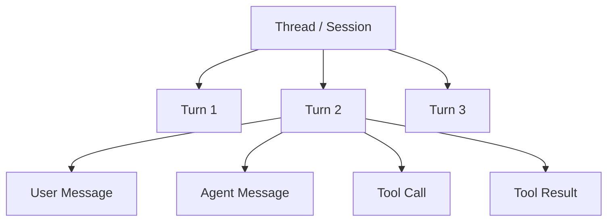
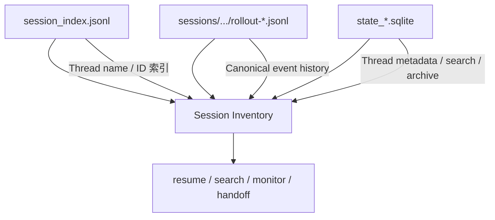
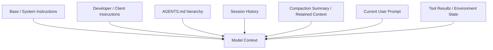
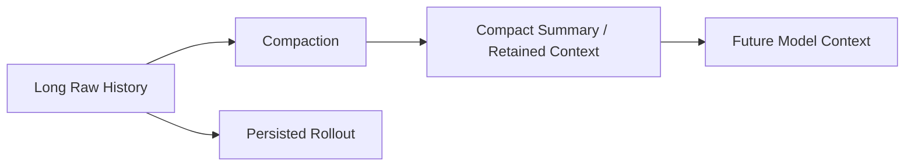
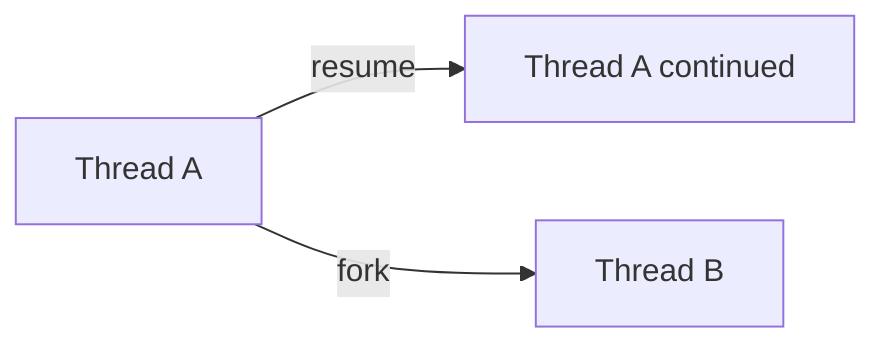
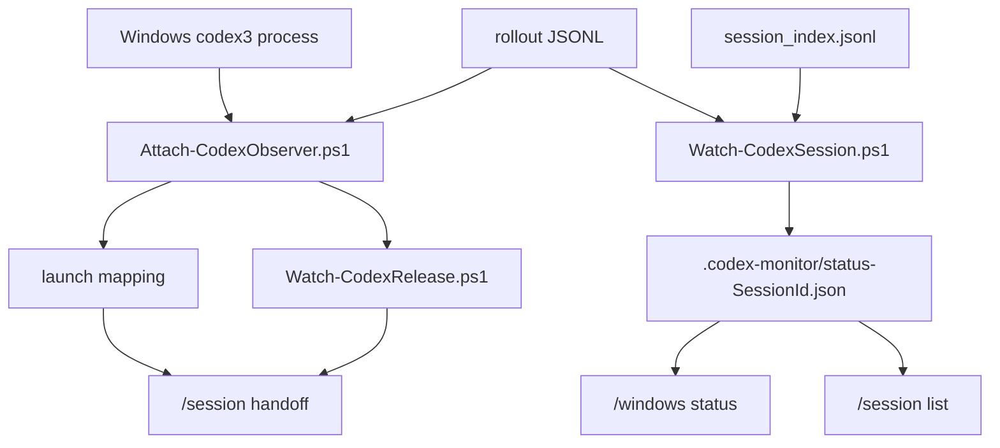

# Codex Session / Thread 管理机制与本地存储参考

[English](./03-codex-session-management.md) | **简体中文**

> 目的：整理 Codex CLI / App Server 的 Session（Thread）持久化、恢复、上下文、Prompt、Token Usage、Compaction 等核心知识，并记录本项目开发过程中实际使用过的文件和方法，作为未来开发 Session 管理、远程控制、迁移、搜索、监控、统计和恢复工具时的技术参考。
>
> 本文同时包含两类信息：
>
> - **本项目实测**：主要基于 Windows + Codex CLI 0.155.x、独立 `CODEX_HOME` 的 rollout/status 调试结果。
> - **Codex 公开实现 / 文档**：基于 OpenAI Codex 官方文档和 `openai/codex` 开源代码。内部持久化格式会演进，因此不要把内部字段视为永久稳定 API。

---


## 当前 Session 命令模型

```text
Lark Scope      → /lark status | /lark new | /lark resume
Windows Runtime → /windows status | /windows release
Global Sessions → /session list | /session use | /session handoff | /session handback
```

旧命令继续作为兼容 alias；本文在描述本项目 Session 管理时统一使用新的分组命令。

---

## 1. 核心术语：Thread / Session / Turn / Item

Codex 不同层使用的术语并不完全一致：

```text
用户眼中的“一次聊天”
        │
        ├── CLI 常称 saved chat / session
        ├── App Server 主要称 Thread
        └── rollout 中会出现 session_id / thread_id / turn_id
```

在本项目中，用于恢复和唯一标识长期对话的 UUID 统一称为 **Session ID**，例如：

```text
01a0beb6-d86e-70c0-8607-e4309012ba49
```

App Server 更倾向于称它为 **Thread**。

一个 Thread 包含多个 Turn；一个 Turn 是一次用户请求及其随后执行的工作；Turn 内又有用户消息、模型消息、命令执行、工具调用等 Item。



本项目额外引入 **Writer / Owner** 概念：

```text
同一个 Session
   │
   ├─ Windows Codex TUI
   └─ Lark scope

任意时刻只允许一个逻辑 writer。
```

这不是 Codex 自身存储格式的一部分，而是本项目为安全 handoff 增加的约束。

### 远程控制面：Lark Mobile App 与 Lark Web

本地增强版现在不仅提供文本命令，也通过 Lark Interactive Card 暴露 Session 管理能力，目标是让 **Lark Mobile App** 和 **Lark Web** 都可以方便地进行远程操作：

```text
/lark status
→ 当前 Lark scope + 快捷 Action

/windows status
→ Windows runtime Sessions + Release Action

/session list
→ 全局 inventory + Use / Handoff / Hand Back Action
```

Action 的显示名称与真正执行目标严格分开：

```text
显示：唯一 Thread Name
      Thread Name 重名时 + short Session ID
      没有 Thread Name 时使用 short Session ID

执行：exact full Session ID
```

Project Name 和 cwd 只是辅助 metadata，不能作为 Action identity，因为多个 Session 完全可能共享同一个项目目录。这个规则在手机端尤其重要：用户看到的是可读按钮，不需要手工输入长 Session ID，而底层仍通过完整 Session ID 精确定位。Lark Web / Desktop 还可以显示 `hover_tips`；Mobile 主要依赖按钮本身的文字。

---

## 2. `CODEX_HOME`：所有本地状态的根

默认 Codex home 通常是：

```text
~/.codex
```

本项目针对第三方 API Provider 使用独立目录：

```text
C:\Users\<user>\.codex-cli-thirdparty
```

通过：

```powershell
$env:CODEX_HOME = "$HOME\.codex-cli-thirdparty"
```

隔离配置和 Session。

典型目录可抽象为：

```text
$CODEX_HOME/
├─ config.toml
├─ AGENTS.md                         # 可选：全局指令
├─ session_index.jsonl
├─ sessions/
│  └─ YYYY/MM/DD/
│     └─ rollout-...-<SessionId>.jsonl
├─ archived_sessions/                # 版本/客户端相关
├─ state_*.sqlite                    # 新版 Thread metadata / state
├─ logs_*.sqlite                     # 版本相关
├─ memories_*.sqlite                 # 某些版本/客户端可能存在
├─ auth.json                         # 官方登录环境可能存在
└─ 其他 cache/runtime 文件
```

不要假设每个版本都会出现所有文件。做工具时应采用“能力探测”而不是硬编码“目录中一定有某文件”。

---

## 3. Session 数据的三个主要数据面



对本项目而言：

- `rollout-*.jsonl` 是最重要的历史事实源；
- `session_index.jsonl` 主要用于 Thread name；
- `state_*.sqlite` 目前没有成为核心依赖，但未来做高性能 Session Manager 很有价值。

---

## 4. `rollout-*.jsonl`：最重要的 Session 事件流

路径示例：

```text
$CODEX_HOME\sessions\2026\09\20\
rollout-2026-09-20T05-07-30-01a0beb6-....jsonl
```

每一行都是独立 JSON 对象。

### 本项目实际用它做什么

开发过程中，我们通过 rollout：

```text
识别新 Session
取得 Session ID
取得 cwd
取得 CLI version
取得 model / provider
读取 approval / permission 信息
推断 Working / Waiting
读取 token usage / context
观察 task_started / task_complete
```

### 实测常见顶层类型

在 Codex CLI 0.155.x 中观察到：

```text
session_meta
turn_context
event_msg
response_item
token_usage_record
world_state
```

Codex 开源实现还可能持久化或使用例如：

```text
Compacted
RetainedContext
WorldState
RealtimeItem
InterAgentCommunication
```

因此解析器必须容忍未知事件：

```typescript
switch (item.type) {
  case 'session_meta':
  case 'turn_context':
  case 'event_msg':
    // parse
    break;
  default:
    // preserve or ignore for forward compatibility
    break;
}
```

不要把“当前见过的 event type”当成固定 schema。

---

## 5. `session_meta`：Thread 的初始身份信息

本项目实际见过的字段包括：

```text
session_id
id
timestamp
cwd
originator
cli_version
source
thread_source
model_provider
base_instructions
history_mode
context_window
git
```

适合回答：

```text
这个 rollout 属于哪个 Session？
启动时 cwd 是什么？
CLI 版本是什么？
Session 从哪里启动？
初始 provider / base instructions 是什么？
```

### `cwd` 特别重要

Handoff 至少需要保存：

```text
Session ID
+
cwd
```

因为只知道 Session ID、不知道工作目录，很容易在错误项目中继续工作。

### `source` 也值得保留

不同入口可能标记为 CLI、编辑器、exec 等来源。Resume picker 和 Session list 在不同版本中可能按 source 过滤，因此：

```text
rollout 文件存在
```

并不等于：

```text
默认 picker 一定显示该 Thread
```

程序化恢复时，优先按稳定 Thread/Session ID。

---

## 6. `turn_context`：每一轮的执行环境快照

本项目观察到：

```text
turn_id
root_turn_id
cwd
workspace_roots
current_date
timezone
approval_policy
approvals_reviewer
sandbox_policy
permission_profile
model
comp_hash
personality
collaboration...
```

这类事件描述：

> 这一 Turn 在什么目录、模型、权限、时间和协作模式下执行。

因此显示“当前 Session 状态”时不要只读最初 `session_meta`。模型、cwd、权限等可能在后续发生变化。

推荐聚合策略：

```text
session_meta initial values
        ↓
latest turn_context
        ↓
latest thread_settings_applied
        ↓
后出现的值覆盖较旧值
```

这也是本项目 `Watch-CodexSession.ps1` 的基本思路。

---

## 7. `thread_settings_applied` / Thread Settings

本项目在 `event_msg` 中观察到 `thread_settings_applied`，其 settings 可包含：

```text
model
model_provider_id
reasoning_effort
approval_policy
permission_profile
cwd
personality
collaboration_mode
```

对于 status UI，这类最新 settings 往往比初始 `session_meta` 更有价值。

---

## 8. `session_index.jsonl`：Thread name 的主要索引

示例：

```json
{
  "id": "01a0...",
  "thread_name": "Online-Web-Forms",
  "updated_at": "2026-09-19T21:41:25.9104746Z"
}
```

关键特征：

```text
append-only
同一个 Session ID 可能出现多条 rename 记录
最新 updated_at / 最后 append 的记录 wins
```

错误做法：

```text
找到第一个相同 ID 就停止
```

正确做法：

```text
扫描所有相同 ID
→ 选最新记录
```

Windows PowerShell 5.1 读取包含中文 Thread name 的文件时应显式使用 UTF-8，避免乱码。

本项目中：

```text
rollout
→ Session ID / cwd / state / model / usage

session_index.jsonl
→ Thread name
```

---

## 9. `state_*.sqlite`：未来 Session Manager 最值得关注的数据源

本项目目前没有把它作为必须依赖，但新版 Codex 越来越多的 Thread metadata、搜索、归档、列表能力会借助状态数据库。

适合未来开发：

```text
高性能 /session list
几百 / 几千 Thread 搜索
分页
按 cwd / source / provider 筛选
Archived Session
Thread title / preview
快速 Recent 列表
```

### 为什么当前没有直接依赖

因为：

```text
rollout + session_index
```

已经足够支持：

```text
Windows discovery
Observer
Thread name
cwd
model
usage
handoff
```

而直接绑定内部 SQLite schema 会提高版本耦合。

### 建议

优先：

```text
read-only
```

避免直接手工修改 SQLite。Rollout、index、state DB 可能互为 canonical history 与投影；修改其中一个可能制造漂移。

---

## 10. Prompt 不是“一个字符串”

一次模型调用实际上下文更接近多层组合：



因此要做 Prompt Inspector 时，不要简单认为：

```text
user prompt + assistant response
```

就是模型真正看到的全部 context。

---

## 11. Base / System Instructions

本项目在 `session_meta` 中实际见到：

```text
base_instructions
```

它适合调试：

```text
这个 Session 启动时使用了什么基础指令？
不同 Codex 版本 / 模式的基础 prompt 是否变化？
```

但它不一定代表模型完整的所有 system/developer input。

实际模型上下文还可能包括：

```text
AGENTS.md
开发者指令
sandbox / permissions
tool schemas
动态环境信息
历史消息
compaction summary
```

---

## 12. `AGENTS.md`：长期项目指令

Codex 官方支持分层指令发现：

```text
$CODEX_HOME/AGENTS.md
项目根 AGENTS.md
子目录 AGENTS.md / AGENTS.override.md
```

从项目根到 cwd 逐层合并，越靠近当前目录的规则越晚出现，因此优先级更高。

适合写：

```text
测试命令
代码风格
仓库约束
部署约定
团队 workflow
```

不适合把一次性 Session 状态塞进 AGENTS。

Session 工具若要解释：

```text
为什么相同 user prompt 在两个目录行为不同？
```

应同时检查：

```text
cwd
+
AGENTS instruction chain
```

---

## 13. User Prompt、Response Item 与 Transcript

普通用户输入和模型/工具输出最终会形成 Session history 中的 item/event。

`response_item` 可能表示：

```text
assistant message
tool / function interaction
Responses API item
```

Rollout 是机器事件日志，不是可直接展示的 Markdown 聊天记录。

构建 transcript 时应：

```text
RolloutItem
→ normalize
→ filter internal-only items
→ map to user / assistant / tool timeline
```

---

## 14. Reasoning 与私有推理边界

未来做 Session Inspector 时应区分：

```text
持久化事件
≠ 模型看到的全部上下文
≠ 可以展示给用户的全部内容
```

可以稳定依赖的通常是：

```text
user messages
assistant messages / finals
tool calls / results
turn metadata
reasoning summary（如果支持）
compaction summary
```

不要把功能设计建立在“完整内部 chain-of-thought 必然以明文存储”这一假设上。

---

## 15. Context Compaction

长 Session 不会无限把全部历史原样送入模型。

Codex 支持：

```text
/compact
automatic compaction
```

Compaction 的作用可以理解为：



关键区别：

```text
磁盘上的完整历史
```

与：

```text
下一轮真正送给模型的有效上下文
```

不是同一件事。

未来做 Session replay 时，不应该简单把 rollout 每一行重新拼回模型，而应尽量遵循 Codex 自己的 context reconstruction 语义。

---

## 16. `Compacted` / `RetainedContext` / `WorldState`

这些事件/结构对高级 Session 工具很重要。

### Compacted

表示历史发生了 context compaction。

### RetainedContext

表示 compact 后仍需要保留给后续模型调用的有效上下文。

### WorldState

与工作区、环境状态或恢复所需状态有关。

对未来开发的启示：

> “查看完整历史”和“恢复模型 context”必须分开设计。

---

## 17. Context Window 与自动压缩阈值

Codex 配置支持类似：

```toml
model_context_window = 128000
model_auto_compact_token_limit = 64000
```

如果没有显式配置，Codex 会根据 model metadata 使用默认值。

不要在外部工具中硬编码：

```text
某模型一定 128K
某比例一定触发 compact
```

模型和 Codex 版本都会变化。

---

## 18. Context 百分比：不要简单做 `used / total`

开发本项目时曾观察：

```text
rollout token usage ≈ 13.7K
context window ≈ 258K
```

简单除法会得到约：

```text
95% left
```

但 Codex TUI 有时显示接近：

```text
99% left
```

原因之一是 Codex UI/context accounting 可能扣除固定或模型相关 baseline、使用不同的 current-context 口径，且 compaction 后还可能重新估算 context usage。

因此：

> 如果目标是与 Codex `/status` 完全一致，不要只用 `thread cumulative tokens / context window`。

应尽量复用当前 Codex 版本的 context accounting 逻辑。

---

## 19. `token_usage_record`

本项目实际观察到：

```text
thread_id
turn_id
session_id
root_turn_id
response_id
usage
turn_token_usage
thread_token_usage
```

常见 usage 维度：

```text
input_tokens
cached_input_tokens
output_tokens
reasoning_output_tokens
total_tokens
```

可以同时存在：

```text
本次响应 usage
当前 Turn 累计
整个 Thread 累计
```

---

## 20. Context Usage、累计 Usage、Billing 是三件不同的事

非常重要：

```text
当前有效 Context
≠ Thread 累计 token
≠ API 最终账单
```

例如 Thread 累计 1M token，并不意味着当前模型上下文里还有 1M token；长历史可能已经 compact。

反过来，当前 context 50K，也不能推导整个 Thread 只花了 50K。

---

## 21. Token Usage 与费用估算

Rollout usage 可以用于 **估算**，但不能单独当作最终账单。

通常需要：

```text
input
cached input
output
model
provider
service tier
provider-specific pricing
```

第三方 Provider 尤其应把：

```text
Usage
```

和：

```text
Pricing
```

分离。

推荐数据模型：

```text
TokenUsageRecord
       +
Model
       +
Provider
       +
Price Table
       ↓
Estimated Cost
```

如果使用 OpenAI API，可参考官方 Pricing；第三方 Provider 应使用其自己的账单规则。

---

## 22. Rate Limit / Quota 也不是 Token Usage

未来做 Dashboard 时至少区分：

```text
Context Window
Current Context Usage
Thread Cumulative Usage
Estimated Billing Cost
Rate Limit
Subscription / Provider Quota
```

不要因为“Context 90% left”就显示“API quota 90% left”。

---

## 23. Resume：优先保存 Thread / Session ID

CLI 支持：

```text
codex resume
codex resume <Thread-ID>
```

App Server 支持：

```text
thread/start
thread/resume
thread/fork
thread/read
thread/list
```

官方 App Server 文档明确把 Thread 作为核心原语。

对 handoff 工具，最低限度应保存：

```text
Session / Thread ID
cwd
```

Rollout path 可以做诊断和 fallback，但不要让普通恢复流程过度依赖文件路径。

---

## 24. Resume 与 Fork 的区别

```text
resume
→ 在原 Thread 上继续追加

fork
→ 从已有历史派生一个新 Thread ID
```



未来如果需要：

```text
让 Lark 从当前 Session 开一个实验分支
```

应优先考虑 fork，而不是复制 rollout 文件。

---

## 25. Read / List：未来比直接扫文件更稳定的方向

Codex App Server 已提供：

```text
thread/read
thread/list
```

它们可以在不 resume 的情况下读取 Thread metadata / history。

未来本项目如果从“本地脚本式 Session Manager”进一步产品化，值得优先评估：

```text
Bridge
→ Codex App Server thread/list
→ thread/read
→ thread/resume
```

而不是无限增加对内部 rollout/schema 的直接依赖。

---

## 26. Archive

新版 Codex 还支持 archive/unarchive，并可能在：

```text
archived_sessions
state DB
```

中体现。

未来 `/session list` 可扩展：

```text
/session list active
/session list archived
/session list all
```

本项目当前未将 archive 作为核心功能。

---

## 27. 新启动 Codex 为什么有时还没有 Session

开发过程中确认：

```text
codex3
```

刚启动 TUI，但用户尚未真正产生持久化交互时，可能只有：

```text
Windows process
LaunchId
cwd
Owner PowerShell PID
```

而我们的正式 Session inventory 需要：

```text
Session ID
rollout
session/index metadata
```

所以应区分：

```text
Pending Launch
      ↓
Persisted Session
      ↓
Active Writer
      ↓
Detached / Archived
```

这解释了“Codex 窗口已经打开，但 `/session list` 暂时没有”的情况。

---

## 28. 本项目如何使用这些文件



### Attach

使用：

```text
process
cwd
launch time
rollout session_meta
```

发现 Session。

### Observer

读取：

```text
rollout + session_index
```

生成轻量 status projection。

### `/session list`

聚合：

```text
session_index
rollout metadata
Windows monitor
Lark SessionStore
```

显示 owner / project / thread / cwd。

卡片顶部提供分类切换（取最近 10 个 Session）：

```text
● ↪ Handoff (n)   ▶ Use (n)   ↩ Hand Back (n)   🗂 All (n)
```

分类与每行按钮同源（`sessionCategory()` 镜像 `sessionActionButtons()`），
因此列在 Handoff 下的 Session 一定会渲染 Handoff 按钮。默认打开可 Handoff
分类；若为空则依次回退到 Hand Back / Use / All。更早的 Session 用
`/session list <keyword>` 查找。

点击分类按钮会**撤回旧卡片并发出新卡片**（先发后撤，以便在话题群里落到正确的
thread），因此卡片会移到对话底部。没有用原地更新：`channel.updateCard()` 底层的
`im.v1.message.patch` 被飞书拒绝时返回 HTTP 200 + 非零 code，SDK 丢弃了响应，
既不抛错也不生效；CardKit 2.0 的 `createCard()` 又不接受 `shell()` 生成的 v1 结构。

### Claude Code 会话

**命令在 Codex bot 和 Claude bot 上完全相同**，不带任何 agent 参数：

```text
/session list [handoff|use|handback|all|keyword]
/session use <selector>
/session handoff <selector>
/session handback
/session tail [selector]
```

bot 由自己 profile 的 `agentKind` 决定操作哪种会话——一个 profile 只有一个
`agentKind`（`profile-schema.ts`），`createRuntimeAgent()` 只构造一个 adapter，
运行期间不会改变。所以同一个 bot 只列出、只绑定、只接管自己那一种会话；要同时
管理两种，就各用一个 bot（各建一个 Group，或把两个 bot 放进同一个 Group）。

旧写法里的 `codex` / `claude` 参数仍被接受但会被忽略（`withoutAgentTokens()`），
以免已经发在聊天里的旧卡片按钮失效。选择器命令只忽略**开头**的这个词、且后面
还有内容时才忽略，因此标题恰好叫 "claude" 的会话仍能被选中。

实现在 `src/commands/session-provider.ts`：`SessionProvider` 接口把"形状"与
"读取"分开——`SessionInventoryItem` / `HandoffState` 本就 agent 无关，只有填充
逻辑是 Codex 专用的。Claude 实现见 `claude-session-state.ts` 与
`src/session/claude-transcript.ts`。

数据来源：

| 字段 | 来源 |
|---|---|
| sessionId / 更新时间 | `~/.claude/projects/*/<uuid>.jsonl` 文件名与 mtime |
| cwd | transcript 行内 `cwd` 字段（目录名编码有损，不可反解） |
| 标题 | `<id>/custom-title.json` → 最后一条 `ai-title` → 首条 user prompt |
| 运行态 | `~/.claude/sessions/<pid>.json`（Claude 自带注册表，无需 Observer） |

旧版 Claude 写的 per-project `sessions-index.json` 被刻意忽略：它比其列出的
transcript 活得久（定期清理只删 transcript），读它会产生幽灵行。

**能力**：Codex 与 Claude Code 的 list / tail / use / handback / handoff 全部对等。

`SessionProvider.supportsHandoff` 为 false 的 provider（目前没有），其 Windows
运行中的会话既不进 Handoff 分类也不渲染 Handoff 按钮，保持两者一致。

### Claude 注册表的三个实测结论

三者都推翻了最初的假设，直接决定了实现：

1. **`updatedAt` 不是心跳。** 它只在有活动或状态变化时更新；空闲会话的条目
   会合法地停在几分钟前。若按 Codex 的 30 秒新鲜度判定，空闲会话——也就是
   唯一可以安全 handoff 的状态——永远不会是 Ready。因此存活性只看 PID，
   身份再由 release 脚本用 `procStart` 校验。
2. **`claude -p` 也会注册，且 `kind` 同样是 `"interactive"`**，区别只在
   `entrypoint`：终端窗口是 `"cli"`，`-p`（包括 bridge 自己的 Lark 运行）是
   `"sdk-cli"`，退出时条目会被删除。若不排除，每次 Lark 运行都会被误报为
   "Windows · Working" 或 "⚠ Windows + Lark"。
3. **从未输入过的窗口没有 transcript。** 登记条目在启动时就写出，transcript
   要等第一条输入才创建。只扫 transcript 会漏掉这类窗口，所以要从登记里补上。

判定规则（`claude-session-state.ts`）。除 Busy 外，Claude 的 Needs validation
全部标记为 `transferable: false`——释放脚本对这些情况都会拒绝，提供按钮只会
注定失败：

| 条件 | 结果 |
|---|---|
| 无存活条目，或 `entrypoint` 以 `sdk` 开头 | Detached |
| `status: "busy"` | Busy |
| `status` 不是 `"idle"`（未知取值） | Needs validation |
| `entrypoint` 不是 `"cli"`（如 IDE） | Needs validation，需手动关闭 |
| 管理员窗口（EPERM）且 Release Agent 未运行 | Needs validation |
| 没有 transcript | Needs validation（No conversation yet） |
| 缺 `procStart` | Needs validation |
| 其余 | Ready |

### 权限级别：EPERM 不等于进程已死

bridge 是上游以 `/RL LIMITED` 注册的计划任务（`\LarkChannelBridge.Bot.<profile>`），
即使从管理员终端执行 `lark-channel-bridge start`，也只是 `schtasks /Run`，
任务按注册时的权限启动，**不继承终端的管理员权限**。

普通权限进程对管理员进程调用 `process.kill(pid, 0)`，得到的是 **EPERM**（进程存在
但无权打开）。原来的 `isProcessAlive()` 把所有异常都当作「进程已死」，导致管理员
窗口里正在运行的会话被显示为 Detached。现在 `processState()` 区分
`alive / denied / gone`，`denied` 视为存活。

Codex 从未表现出这个问题，是因为它判断「在运行」靠的是 Observer 写的心跳文件，
PID 探测只是兜底——而那个兜底对管理员进程其实一直是错的。此修复也关闭了一个
潜在风险：Observer 心跳断掉而 Codex 仍在运行时，旧代码会误判为 Detached，
从而允许 `/session use` 造成双 writer。

> 验证方法的教训：从管理员会话里做的测试复现不了这个问题；`runas /trustlevel`
> 启动的子进程仍是 High 完整性级别。要得到与 bridge 相同的 Medium 级别，
> 可以借 `explorer.exe` 启动（它本身是 Medium）。

未知 entrypoint 仍算 writer：误判为 Windows-active 只会挡住 `/session use`，
误判为 Detached 则会造成双 writer。

### Claude handoff：`Request-ClaudeRelease.ps1`

Claude 没有 Observer，校验与终止合并在一个脚本里（`scripts/windows/`，由
`Install-CodexBridgeScripts.ps1` 安装到 `~\Scripts`）。输出协议与
`Request-CodexRelease.ps1` 同形：`OK|RELEASED|<id>|<pid>` / `ERROR|<CODE>|...`。

终止前必须全部满足，否则拒绝且不动任何进程：

- 恰好一个存活条目认领该会话（否则 `AMBIGUOUS_WRITER`）
- `entrypoint == "cli"`（否则 `UNSUPPORTED_ENTRYPOINT`）
- `status == "idle"`，终止前再读一次（否则 `SESSION_NOT_IDLE`）
- `procStart` 等于存活进程的 `StartTime.ToFileTimeUtc()`（否则 `PID_REUSED`；
  已实测两者逐位相等）
- 映像名为 `claude`（否则 `NOT_CLAUDE_PROCESS`）

然后 `taskkill /PID <pid> /T /F`（连带 MCP server 等子进程，父 PowerShell 终端
保留），确认进程退出，并删除被强杀进程遗留的 `<pid>.json` / `<pid>.*.key`，
防止 PID 被复用后误判。transcript 是 append-only 且会话处于 idle，对话完整；
只会丢失终端输入框里未发送的草稿。

`-DryRun` 开关执行全部校验但不终止，输出 `OK|DRY_RUN|<id>|<pid>`，用于排查。

没有使用注册表里的 `messagingSocketPath` 命名管道做优雅退出：协议未公开、
`peerProtocol` 随版本变化。`claude stop <id>` 只对 `--bg` 后台会话有效。

强制终止的副作用：Claude 来不及恢复终端模式（如焦点上报），原终端之后切换
焦点时会打印出 `[I[` 之类的转义序列。关闭该标签页，或在其中执行
`[Console]::Write("$([char]27)[?1004l")` 即可。

### Claude Release Agent：`Watch-ClaudeRelease.ps1`

bridge 是普通权限，终止不了管理员窗口，而由 bridge 直接启动的释放脚本也继承
普通权限。Codex 没有这个问题，是因为 `codex3` 在管理员终端里启动了 Release
Agent，终止动作由它完成；bridge 只写一个请求文件。Claude 采用同样的结构：

```text
bridge（LIMITED）
  └─ requestClaudeRelease()
       代理心跳新鲜 → 写 ~/.claude-monitor/requests/release-<id>.json，轮询 results/
       否则         → 直接运行 Request-ClaudeRelease.ps1（仅对非管理员窗口有效）

Watch-ClaudeRelease.ps1（管理员权限，全机单例 Global\LarkClaudeReleaseAgent）
  └─ 取请求 → 校验 UUID → 独立进程运行 Request-ClaudeRelease.ps1 → 写结果
```

协议要点：

- 只通过文件通信，bridge 从不直接接触管理员进程；代理是否在运行也看心跳文件
  `agent.json`（每 2 秒更新，10 秒内有效），不探测 PID。
- 请求先写 `.tmp` 再 rename，代理不会读到半个文件；代理先删除请求再执行，
  崩溃也不会重复执行。
- 请求带 `expiresAt`（bridge 截止时间前 2 秒）；过期请求被拒绝，避免 bridge
  已放弃等待后才关掉窗口。bridge 超时会撤回尚未被领取的请求。
- 请求只携带 Session ID，经 UUID 校验后作为参数传入，不拼接命令。
- 代理超时（`AGENT_TIMEOUT`）时 Lark 不会绑定；窗口若已被关闭，会话处于
  Detached，可以安全地 `/session use`。

**为什么需要计划任务**：代理必须以管理员权限运行，而 bridge（普通权限）只能通过
UAC 确认框启动管理员进程，用户在手机上时无人能点。`codex3` 能免费得到管理员权限，
是因为它运行在用户打开的管理员终端里；Claude 是直接启动的，没有这个挂载点。
`Register-ClaudeReleaseAgent.ps1` 注册一个 `/RL HIGHEST`、`ONLOGON` 的计划任务
`\LarkChannelBridge.ClaudeReleaseAgent`——与 bridge 自己用的机制相同，只是权限
级别不同——注册一次，之后每次登录自动以管理员权限启动，不弹 UAC。

实测（Medium 级别进程，与 bridge 处境相同）：代理运行时，管理员窗口由
「Running as administrator」变为 Ready；经代理释放一个临时管理员窗口耗时约
2.3 秒，返回 `OK|RELEASED`，进程退出、登记文件清理、请求与结果目录无残留。

### 绑定必须同时写 session catalog

`run-flow.ts` 决定续接哪个会话的顺序：

1. `sessionCatalog.activeFor(scope, agent, cwdRealpath, policyFingerprint)`
2. 仅 Claude：`sessions.resumeFor(scope, cwdRealpath)`

所以**只写 `sessions.json` 不算绑定**：Codex 完全不读它，Claude 则会被同 scope
同 cwd 的旧 catalog 条目覆盖。`src/commands/session-binding.ts` 的
`bindScopeToSession()` / `unbindScope()` 同时写两处，分别对齐上游的
`applyResume()` 和 `/new`。

两个细节：

- catalog key 含 `cwdRealpath`，而 `policyFingerprint` 也哈希了 cwd。`use`
  会切换 scope 的 cwd，所以命令开始时算好的 `ctx.sessionCatalogIdentity` 已过期，
  必须在 `setCwd()` 之后重新计算 identity。
- handback 必须 archive catalog 条目，否则下一条 Lark 消息仍会从 catalog 续接
  这个会话，与 Windows 形成双 writer。

> 此修复之前，Codex 的 `/session use` 与 handoff 只写 `sessions.json`，续接实际
> 从未生效——日志中没有任何一次 run 续接过被接管的 Windows 会话，下一条消息
> 都开了新 thread。

---

## 29. 为什么不应让 `/session list` 每次完整扫描全部 rollout

大 Session 的 rollout 会越来越大。

错误架构：

```text
每一次 /session list
→ 遍历全部 Session
→ 从头 parse 所有 JSONL
```

随着 Session 数增加会越来越慢。

推荐：

```text
Canonical history:
rollout

Indexes:
session_index / state DB

Live projection:
.codex-monitor/status

UI:
sessions command
```

也就是说：

> rollout 是事实源，但列表 UI 应尽量读取索引和投影。

---

## 30. 推荐的 Session Manager 分层读取策略

### Level 1：Inventory

读取：

```text
session_index
rollout filename
mtime / state DB
```

得到：

```text
Session ID
Thread name
更新时间
```

### Level 2：Metadata

只读取 rollout 前部 `session_meta`：

```text
cwd
provider
CLI version
source
```

### Level 3：Live Monitoring

tail rollout：

```text
task started / complete
settings
token usage
```

得到：

```text
Working / Waiting
model
context
```

### Level 4：Full Transcript / Analytics

完整 replay rollout，用于：

```text
聊天历史
tool 调用分析
token/cost analytics
debugging
```

不要让 Level 4 成为默认 inventory 路径。

---

## 31. Ownership：Codex 原生 Session 之上的额外层

Codex 的持久化本身并不会自动保证：

```text
Windows
Lark
Desktop
VS Code
其他机器
```

不会同时操作同一个 Thread。

因此本项目额外维护：

```text
Windows
Lark scope
Detached
Unknown / Unmanaged
```

### 当前判断来源

```text
Observer heartbeat
launch mapping
Release Agent
Lark SessionStore binding
```

### 一个重要边界

“没有 monitor 证据”不能严格证明“Session 没有 Windows TUI”。

因此旧 Session 可能应显示：

```text
Unknown / Unmanaged
```

而不是简单：

```text
Detached
```

---

## 32. 未来建议升级为显式 Lease

如果未来扩展到：

```text
多台电脑
Telegram
Web Dashboard
SSH
Mobile client
```

建议建立显式 ownership lease：

```json
{
  "sessionId": "01a0...",
  "owner": "windows:host-a:pid-123",
  "leaseId": "lease-...",
  "acquiredAt": "...",
  "heartbeatAt": "...",
  "expiresAt": "..."
}
```

这样可以实现：

```text
Acquire
Renew
Release
Force-expire
Owner conflict detection
```

比通过多个运行时文件间接推断更稳健。

---

## 33. 未来推荐优先考虑 App Server，而不是继续扩大内部文件耦合

如果未来要把本项目做成真正的远程 Codex Session Manager，建议逐步评估：

```text
Codex App Server
├─ thread/list
├─ thread/read
├─ thread/resume
├─ thread/fork
├─ thread/archive
└─ turn/start / interrupt
```

优势：

```text
由 Codex 自己解释内部存储
schema 演进风险更低
可以获得 runtime thread status
更适合分页和搜索
```

内部 rollout parser 仍然适合：

```text
debugging
forensics
额外 analytics
版本兼容 fallback
```

---

## 34. 开发新 Session 功能时的检查清单

建议每个新功能先回答：

1. 这是 **Thread metadata** 还是 **live runtime state**？
2. 事实源应该是 rollout、index、state DB 还是 App Server？
3. 是否需要完整 history，还是只需要 metadata？
4. 是否会修改 Session？如果会，是否可能产生双 writer？
5. 是否正确处理 compaction？
6. 是否区分 current context 与 cumulative token usage？
7. 是否假设了某个内部 event/schema 永远不变？
8. 是否能容忍旧 Session 缺字段？
9. 是否能处理 rename / archive / resume / fork？
10. 是否把 Provider-specific billing 与 Token Usage 解耦？

---

## 35. 核心参考链接

### OpenAI 官方 Codex 文档

- Codex CLI：  
  https://developers.openai.com/codex/cli
- Codex App Server / Thread API：  
  https://developers.openai.com/docs/app-server
- Codex 配置参考：  
  https://developers.openai.com/docs/config-file/config-reference
- Codex 示例配置：  
  https://developers.openai.com/docs/config-file/config-sample
- `AGENTS.md` 指令机制：  
  https://developers.openai.com/docs/agent-configuration/agents-md
- Codex customization overview：  
  https://developers.openai.com/docs/customization/overview

### OpenAI Codex 开源仓库

- GitHub：  
  https://github.com/openai/codex
- 源码检索关键词建议：  
  `RolloutRecorder`, `SessionIndex`, `ThreadManager`, `TokenUsage`, `Compacted`, `RetainedContext`, `ModelContext`, `thread/resume`

### Pricing

- OpenAI API Pricing：  
  https://developers.openai.com/api/docs/pricing

### 本项目相关文档

- [Codex 第三方 API Key](./01-codex-third-party-api-key.md)
- [Lark / Bridge / Codex 架构](./02-lark-bridge-codex-architecture.md)
- [根 README](../README.md)

---

## 36. 总结

未来开发 Session 工具时，最重要的几个结论是：

```text
Session / Thread ID 是核心身份
cwd 是恢复工作上下文的关键元数据
rollout 是最重要的历史事实源
session_index 适合名称索引
state DB 适合高性能查询，但内部 schema 可能演进
完整历史 ≠ 当前模型 context
累计 token ≠ 当前 context ≠ 最终账单
compaction 是恢复语义的一部分
unknown event 必须 forward-compatible
一个 Session 同一时间只应有一个 writer
```

对于本项目，当前的 Windows Observer + Release Agent + Lark SessionStore 已经形成了一个可用的 ownership 层；后续如果继续扩展，最值得投资的方向是 **显式 Lease + Codex App Server integration**。
